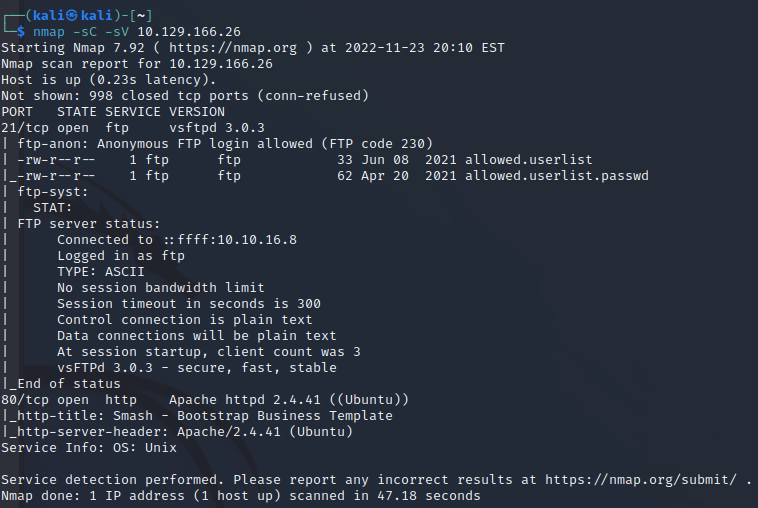
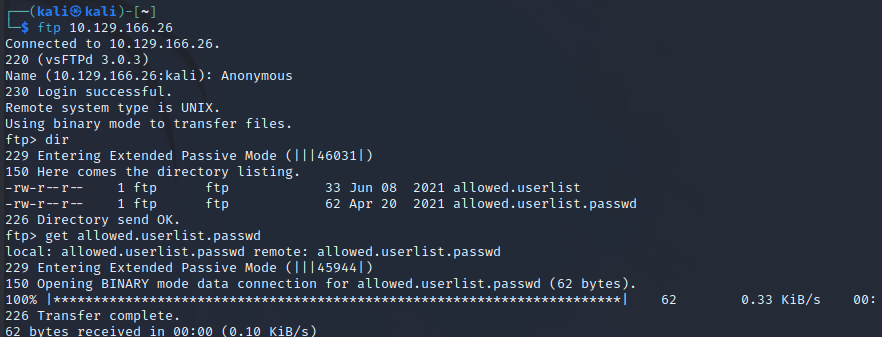
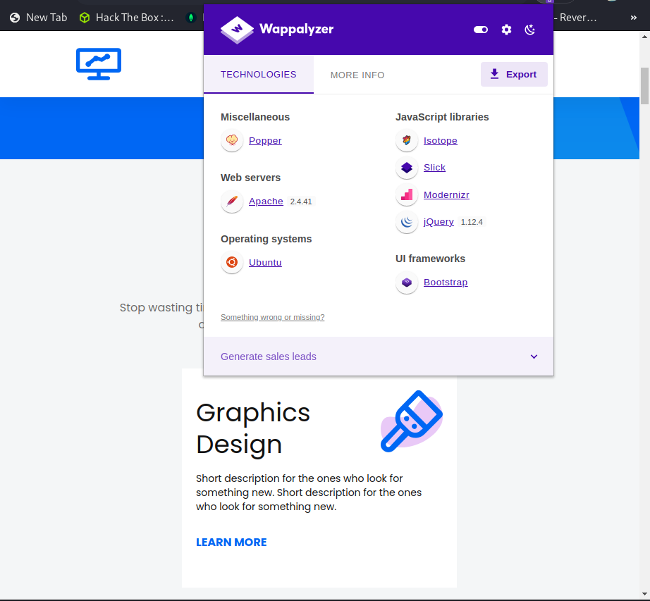
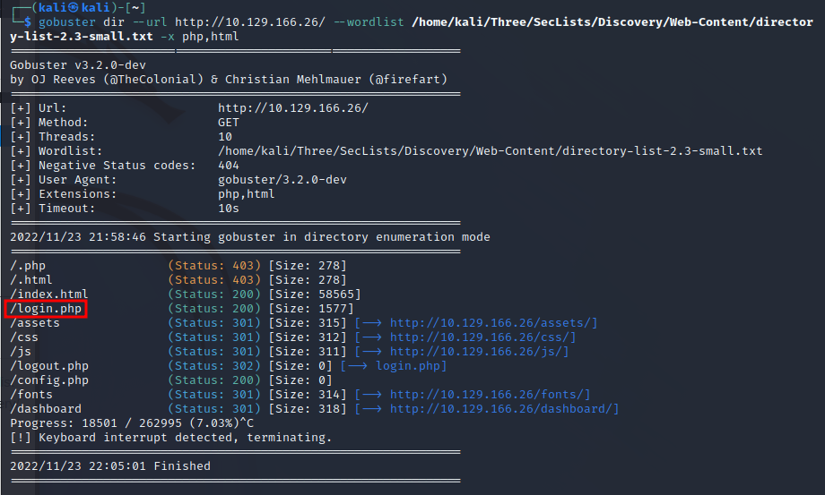
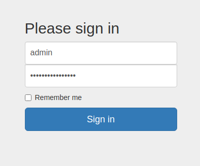

# 1.Port Scan
ip=10.129.166.26
`nmap -sC -sV $ip`

# 2.FTP Server Connect
`ftp $ip`

# 3.Wappalyzer

# 4. Sarch login
`gobuster dir --url http://$ip/ --wordlist /home/kali/Three/SecLists/Discovery/Web-Content/directory-list-2.3-small.txt -x php,html`

# 5.Flag get
http://10.129.166.26/login.php

