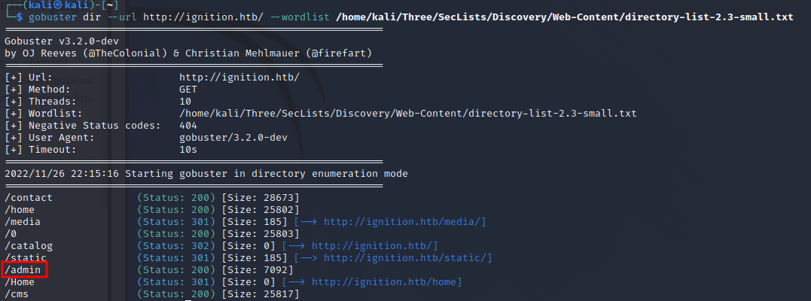

# 1.Port Scan
ip=10.129.167.249
nmap -sC -sV $ip

# 2. Ignition.htb Connect
`curl -v http://$ip/`

`sudo vim /etc/hosts`

# 3.Find Hidden page
 gobuster dir --url http://ignition.htb/ --wordlist /home/kali/Three/SecLists/Discovery/Web-Content/directory-list-2.3-small.txt

**http://ignition.htb/admin**

# 4.Flag.get

