# 1.Port Scan 
ip=10.129.250.6
`nmap -sC -sV $ip`

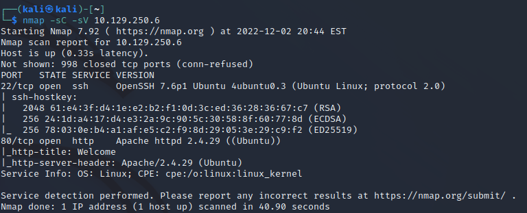

# 2.Burp Suite
## Local Proxy

http://10.129.250.6/

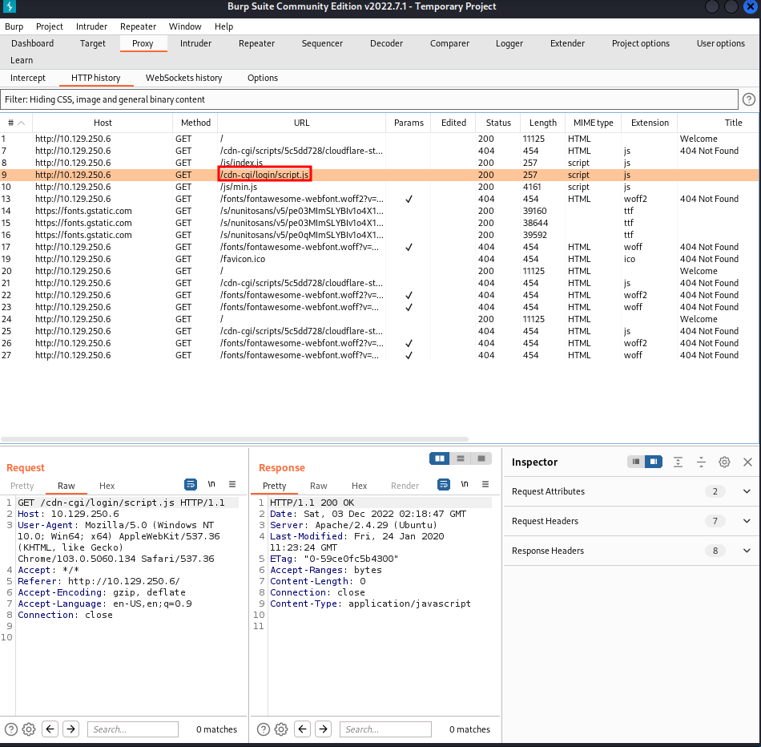

## Guest login

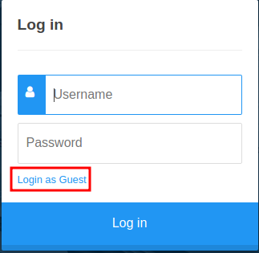

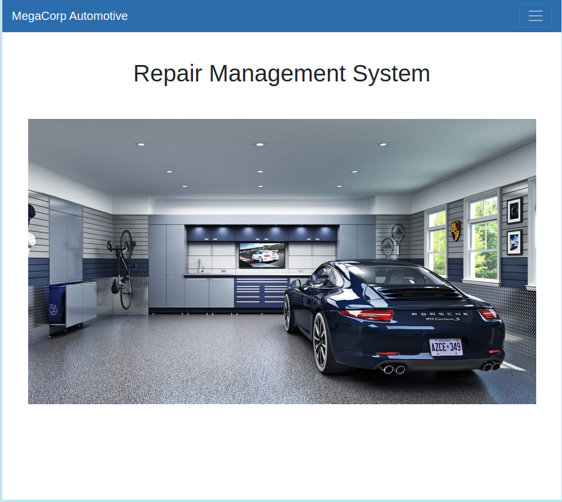

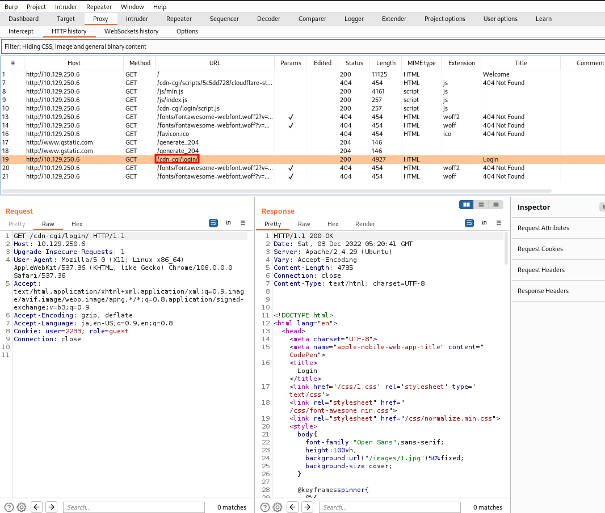

## 3 Fuzzing
## admin info

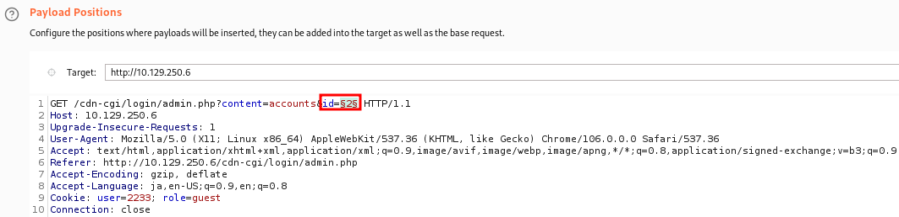

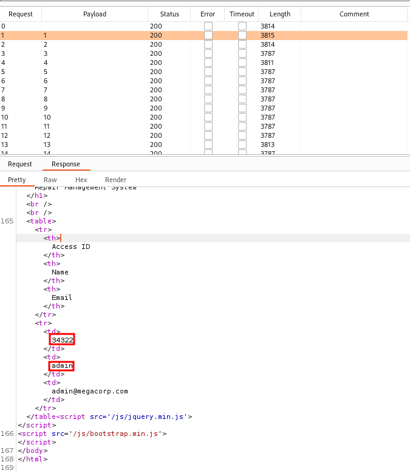

## upload connect
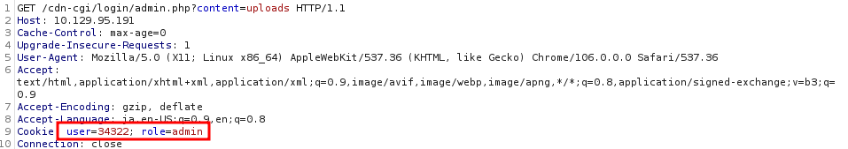

## .4 Revers shell

`sudo vim /usr/share/webshells/php/php-reverse-shell.php`

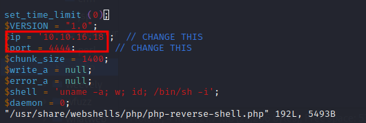

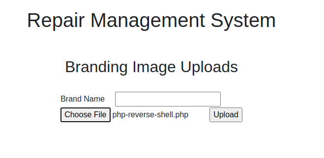

##
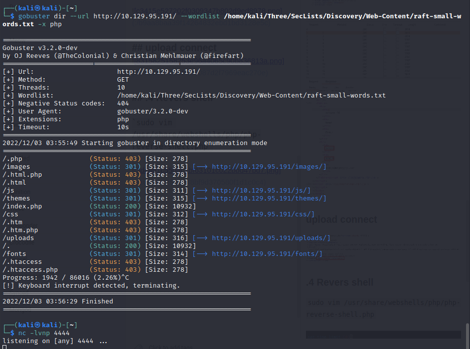

