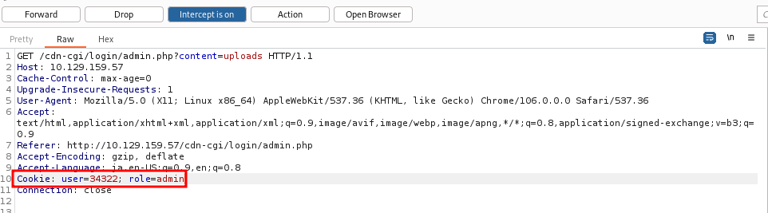
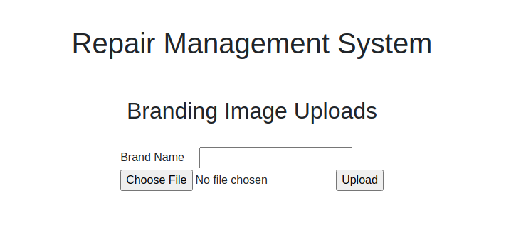
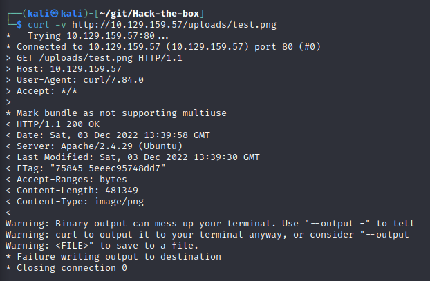
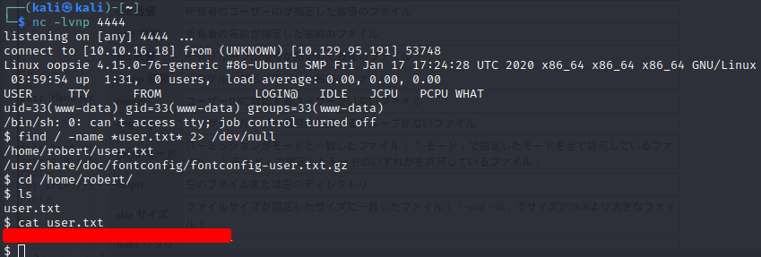
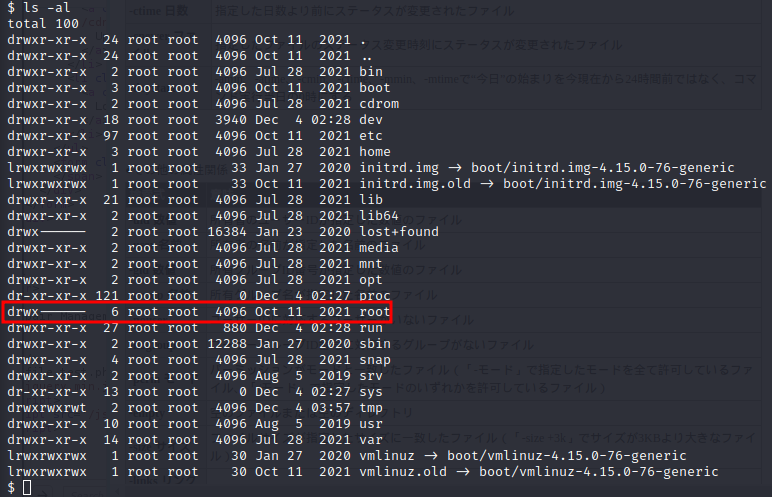
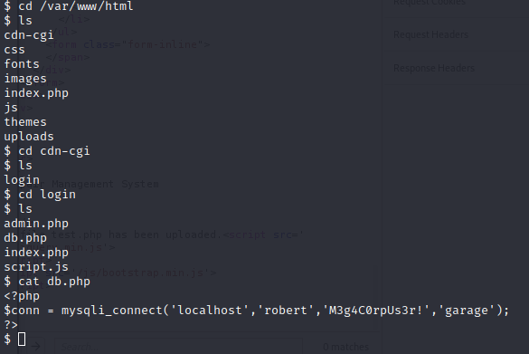
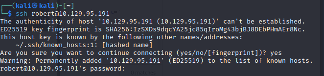
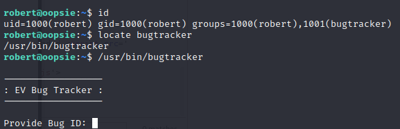
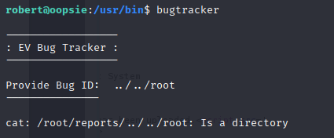
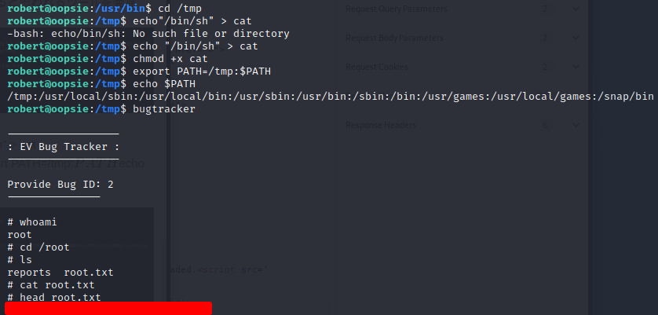

# 1.Port Scan 
対象マシンのポートをスキャン
ip=10.129.250.6
`nmap -sC -sV $ip`

# 2.Burp Suite

## Local Proxy
対象HPに接続
http://$ip/

login用ページと思われるディレクトリを発見

## Guest login
ゲストでログイン

ログインページのパケットを傍受

# 3.Fuzzing
## admin info
右図赤枠の箇所でファジングを実施

ID=1がadminであることを確認

## Revers shell
下図赤枠内パラメータをアドミンの物に変更

管理者用アップローダーへ接続

kaliのデフォルトについてるリバースシェルの下図赤枠内を変更
`sudo vim /usr/share/webshells/php/php-reverse-shell.php`

変更したものをアップロード

アップロードしたものをgobusterで確認。

# 5. Use flag Get
サーバ内のuser.txtを検索

$ find / -name *user.txt* 2> /dev/null

$ cd /home/robert/

$ ls

$ cat user.txt

root.txtがあると思われるディレクリを発見したが権限が無い為アクセスできない。

db.php内のユーザ情報を取得

# 6.SSH connect
 `ssh robert@$ip`
 
 SSHを使いrobertユーザで接続
 
 

権限昇格に使用できると思われるツールを発見

Bug Trackerは/root/reportsディレクリ内にcatを使用することを確認

catに"bin/sh"を入れrootまでのパスを設定する

$ cd /tmp

$ echo "/bin/sh" > cat

$ chmod +x cat  

$ export PATH/tmp:PATH

$ echo PATH

$ bugtracker

