# ＃1\. Port scan

ip=10.10.10.6

sudo nmap -sC -sV $ip

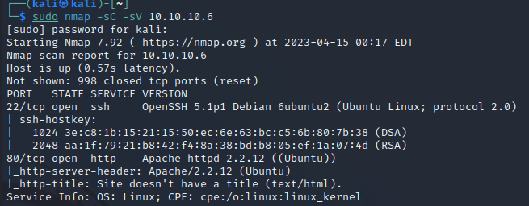"

# #2\. 対象HP/ディレクトリを検索

スキャンしたHPにアクセスした。

http://$ip

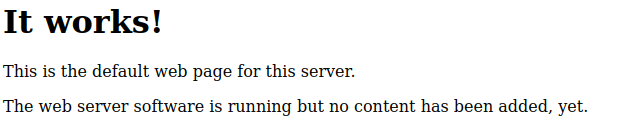

gobusterでディレクトリの検索を実施した。

gobuster dir --url http://$ip/ --wordlist /usr/share/wordlists/dirb/big.txt

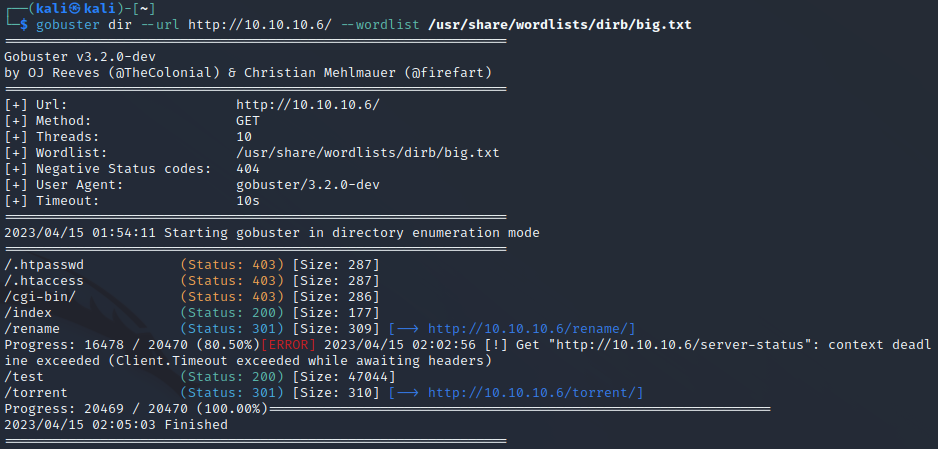

/testディレクトリにアクセスを実施した。

`http://$ip/test`

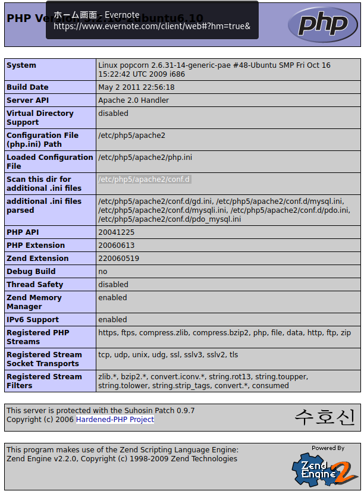

/torrentディレクトリにアクセスを実施した。

`http://$ip/torrent/`

# #3.対象HP内の機能を調査

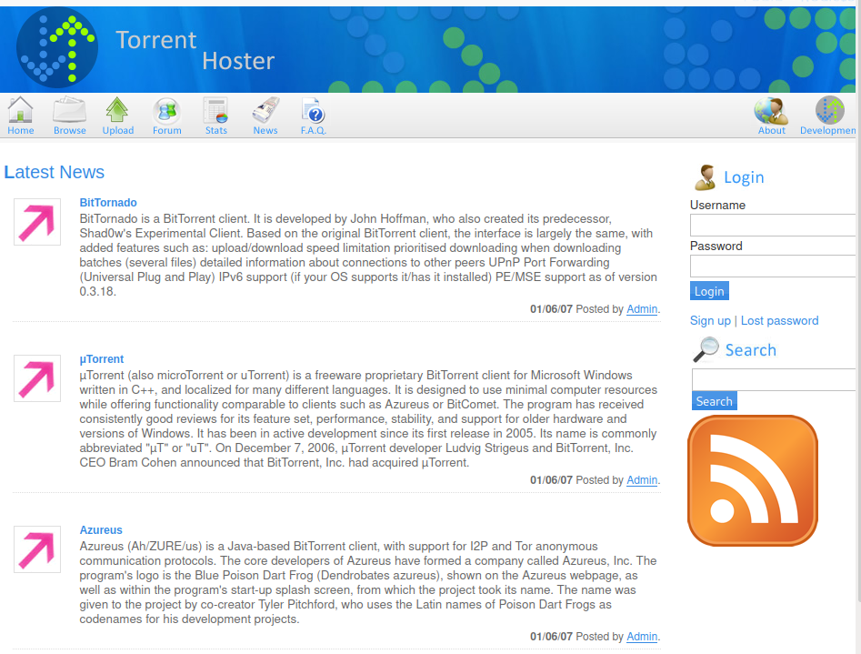

`http://10.10.10.6/rename/`

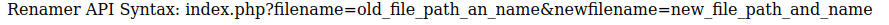

アップロード機能を確認した。

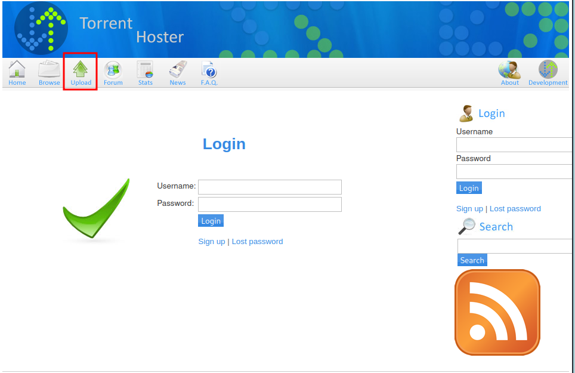

新規アカウントを作成した。

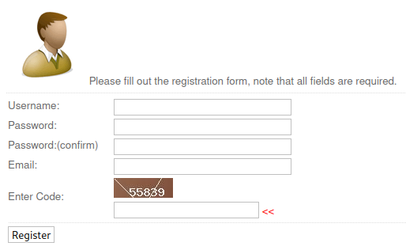

ログインに成功した。

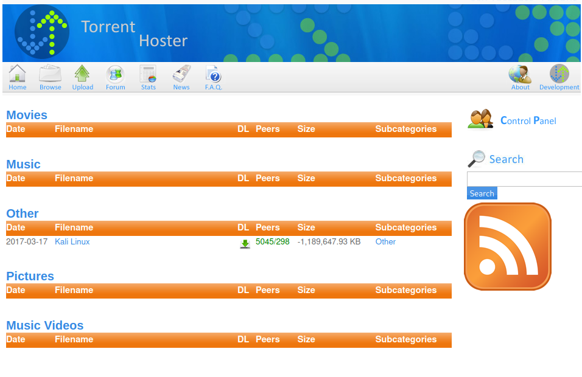

# #4.アップロード機能について調査

reverse-shell.phpのアップロードを試行した。

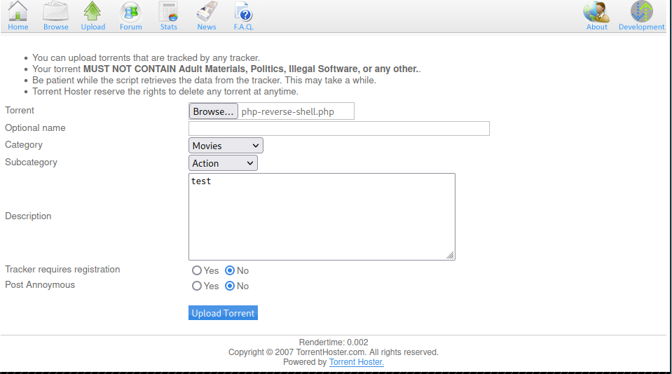

アップロードに失敗した。

torrentファイルをアップロードした。

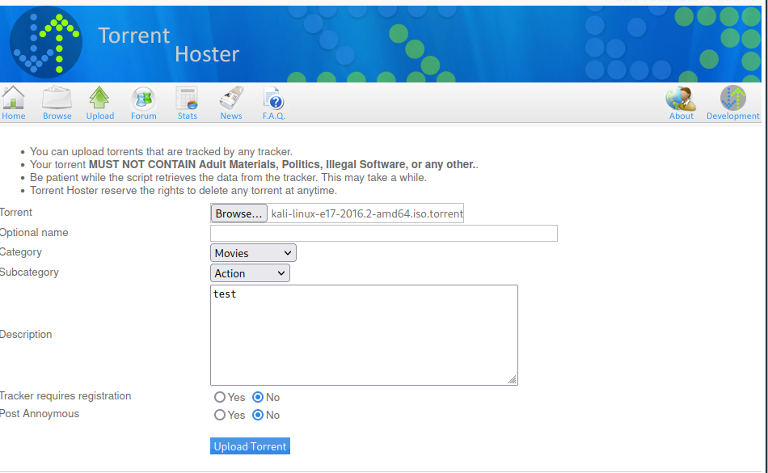

アップロードに成功した。

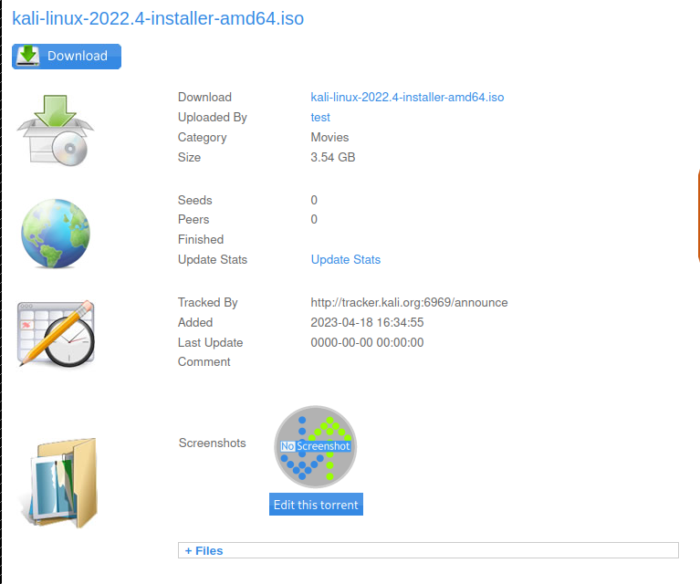

burpsuiteでhttpリクエストをキャプチャーした所、content-Typeがapplication/x-phpであることを確認した。

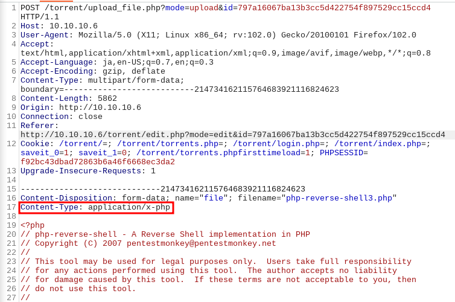

test.txtを試しにアップロードした結果、Contest-Typeがtext/plainになっているのでファイルの拡張子がそのままContest-Typeになることを確認した。

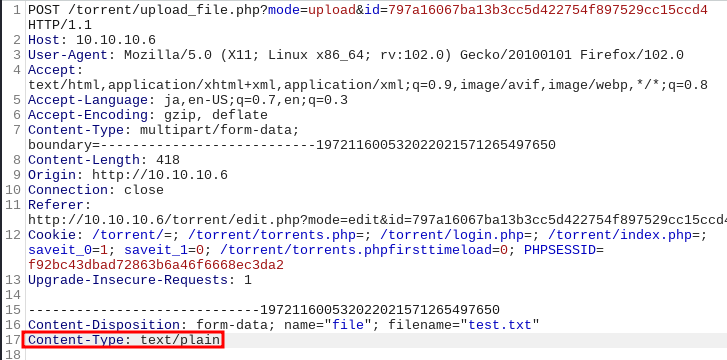

jpegファイルのアップロードを試行して成功した。

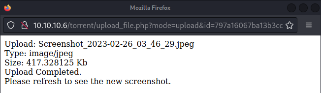

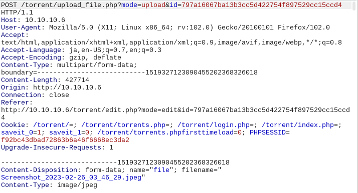

先ほどアップロードしたスクリーンショットを確認した所、通信は発生していなかった。アップロードしたjpegファイルをそのまま実行していると推測する。

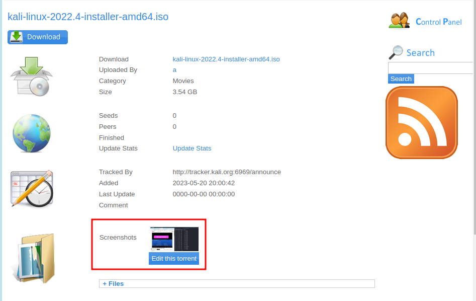

Content-Typeをimage/jpegに変更したらリバースシェルもアップロードでき、実行できる可能性があると推測する。

repeater機能でcontent-typeを変更して送信した結果、成功した。

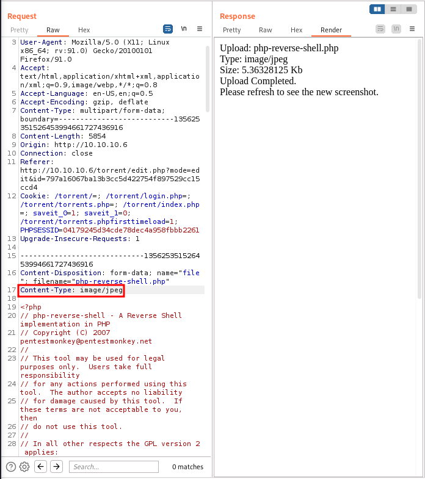

# 5.リバースシェルを使用して対象サーバに接続する

ローカルマシンのポート1234を開けて待ち受ける

`sudo nc -lvnp 1234`

「image file Not Found」をクリック

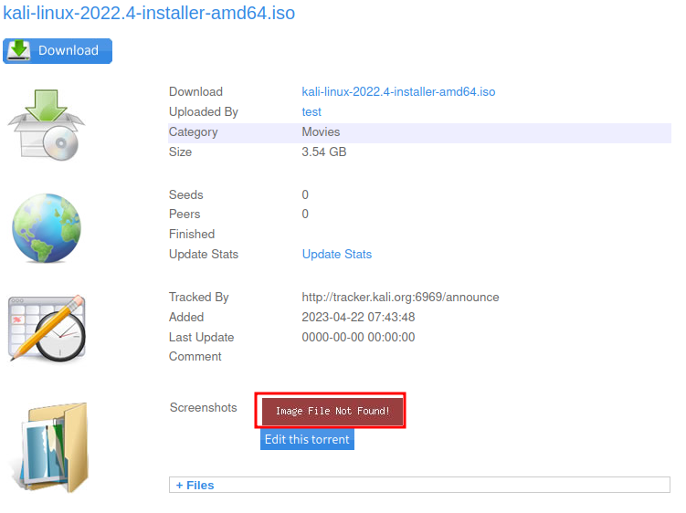

cd /home

cd george

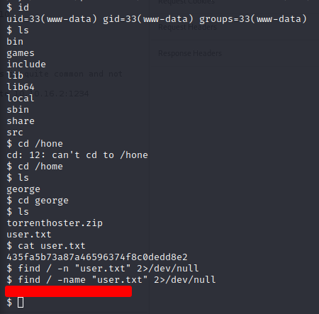

下記コマンドから対象サーバの種類とバージョンを確認した。

`uname -a`

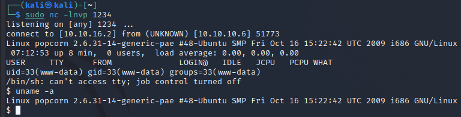

# #6.対象サーバの管理者権限を奪取する。

exploit databaseから

Linux Kernel 3.6.37 攻撃用コードを取得

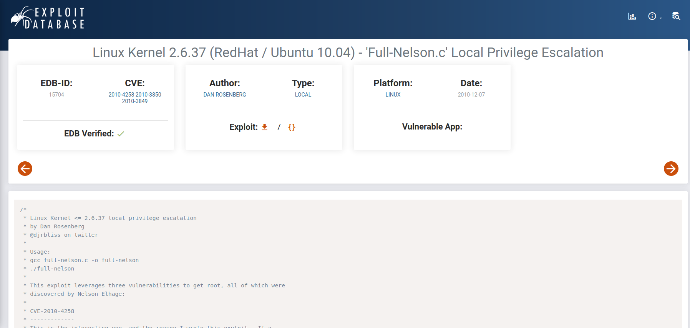

今回はduty cawと呼ばれる脆弱性を利用して攻撃する

Chatgptから

「Dirty COW」とは、Linuxカーネルの脆弱性の1つです。以下の検索結果を参考にすると、「Dirty COW」に関連する情報が見つかります。

「Dirty COW」の脆弱性は、Red Hat Enterprise Linux（RHEL）やFedoraなどのLinuxディストリビューションで報告されています\[1\]。この脆弱性により、攻撃者は特権の昇格やシステムの制御を行うことができます。

また、SELinux（Security-Enhanced Linux）のポリシーによって、攻撃可能な範囲が制限されていることも報告されていますが、Androidにも「Dirty COW」の脆弱性が存在するとされています\[2\]。トレンドマイクロは、既報告の攻撃とは異なる「Dirty COW」を利用した別の攻撃手法を確認しています。

ローカルサーバを立てる

ローカルサーバから15704.cをダウンロード

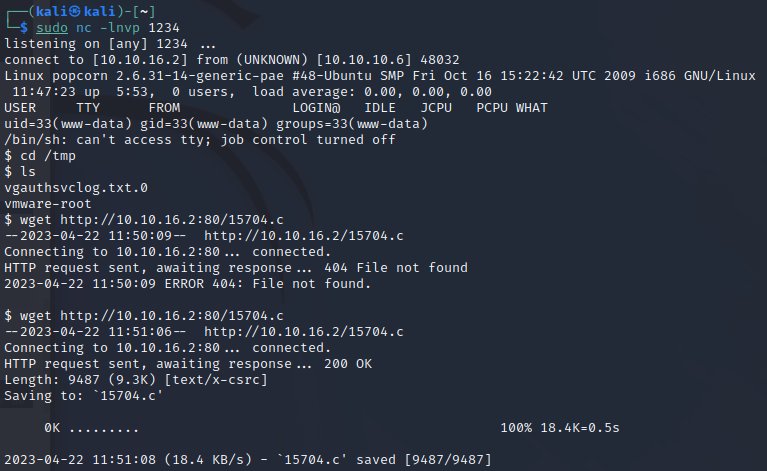

root権限を取得した。

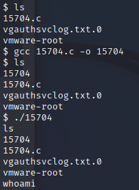

root.txtを取得した。

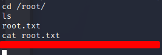