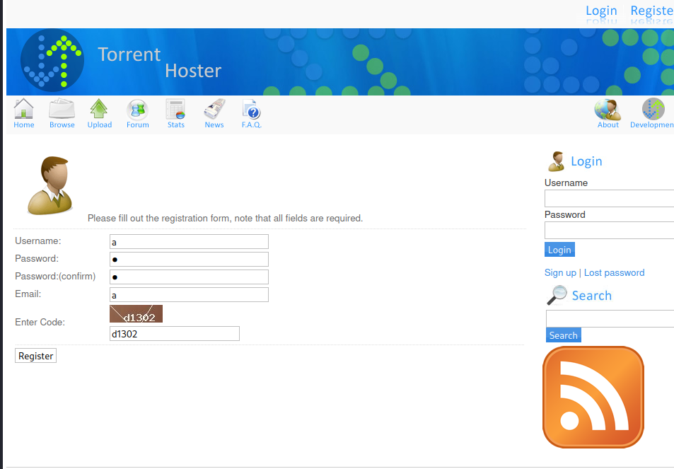
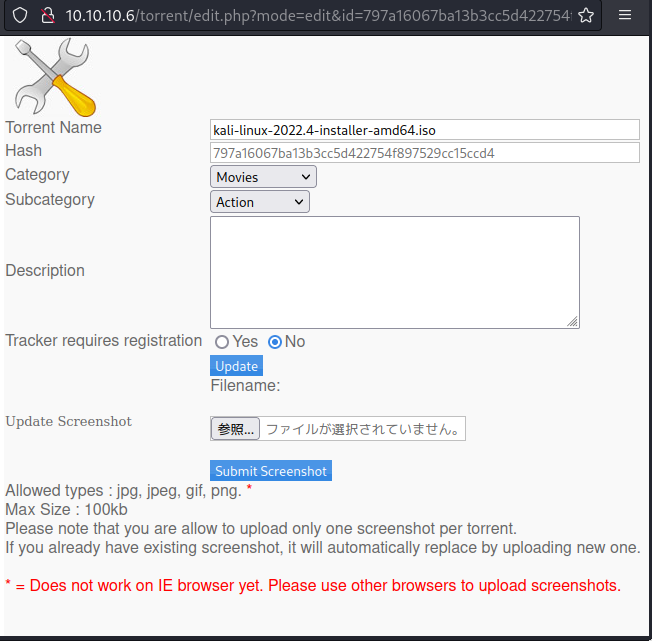
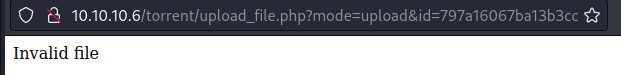
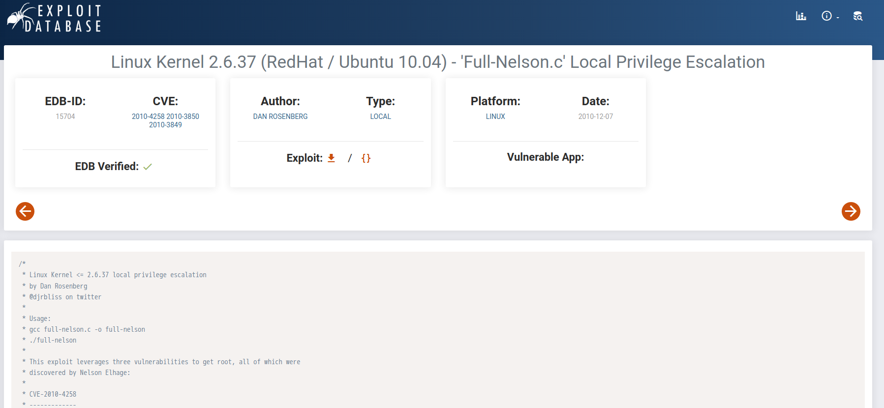
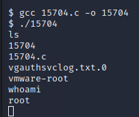

# ＃1\. Port scan

ip=10.10.10.6

sudo nmap -sC -sV $ip

"

tcpポート22番とtcpポート80番が開放されている事を確認した。

# #2\. 対象HP/ディレクトリを検索

開放されているtcpポート80番を調査するために当該ポートにプラウザ上からアクセスした。

http://$ip

その結果下記画面が表示された。

Webサイト上のディレクトリ構造が不明な為、gobusterでディレクトリの列挙を実施した。

gobuster dir --url http://$ip/ --wordlist /usr/share/wordlists/dirb/big.txt

その結果「/index」「/rename」「/test」「torrent」ディレクトリにアクセスできることを確認した。

/testディレクトリを詳細に調査する為プラウザから/testディレクトリにアクセスした。

その結果、サーバ情報を取得することに成功した。

`http://$ip/test`

上記Webページからphpがサーバ上で実行できると推測した。

# #3.対象HP内の機能を調査

/torrentディレクトリを詳細に調査するためにブラウザ上でアクセスした。

`http://$ip/torrent/`

アップロード画面を示唆するリンクを発見した。

アップロード画面にアクセスを試行した結果、ログイン画面に遷移した。

「Sign up」から新規アカウントを作成できるかを試行した。

上記画面でユーザ情報を入力した結果、新規アカウントの作成に成功した。

作成した新規アカウントを使用した結果、ログインに成功した。

# #4.アップロード機能について調査

testディレクトリでphpがサーバ上で実行できる事を確認したので

php-reverse-shell.phpのアップロードを試行したが失敗した。

上記の結果、ファイルの種別を確認していると推測されるためテスト用のtorrentファイルをアップロードした。

その結果、アップロードに成功した。

アップロードしたテスト用torrentファイルをWebページ内で確認した結果、下記ページに遷移した。

Edit this torrentを押下した結果スクリーンショットをアップロードできる機能を発見した。

スクリーンショットのアップロード機能をさらに調査するためにhttpリクエストをキャプチャーした。

reverse-shell-php3.phpをアップロードを試行したが失敗した。

burpsuiteでhttpリクエストをキャプチャーした所、content-Typeがapplication/x-phpであることを確認した。

test.txtを試しにアップロードした結果、試行したが失敗した。Contest-Typeがtext/plainになっているのでファイルの拡張子がそのままContest-Typeになると推測した。

jpegファイルのアップロードを試行して成功した。

先ほどアップロードしたスクリーンショットを確認した所、通信は発生していなかった。アップロードしたjpegファイルをWebページ上でそのまま実行していると推測した。

Content-Typeをimage/jpegに変更したらリバースシェルもアップロードでき、実行できる可能性があると推測した。

php-reverse-shellをアップロードするhttpリクエストをrepeaterで改変して送信した結果、アップロードに成功した。

# 5.リバースシェルを使用して対象サーバに接続する

ローカルマシンのポート1234を開けて待ち受ける

`sudo nc -lvnp 1234`

「image file Not Found」をクリックして、リバースシェルの実行に成功した。

cd /home

cd george

ユーザアカウントの/homディレクトリを検索した結果user.txtを確認した。

下記コマンドから対象サーバの種類とバージョンを確認した。

`uname -a`

対象サーバのKernelバージョンが2.6.31であることを確認した。

# #6.対象サーバの管理者権限を奪取する。

exploit databaseからLinux Kernel 2.6.31用コードを検索した結果、

Linux Kernel 2.6.37 攻撃用コードである15704.cを取得した。

対象のサーバから15704.cをダウンロードさせるためにローカルサーバを立てた。

wgetコマンドを使用して15704.cをダウンロードできるかを試行した。

結果、ローカルサーバから15704.cをダウンロードさせて対象のサーバ上に保存させることに成功した。

gccコマンドを使用して15704.cをコンパイルさせることで15704という実行ファイル生成した。

15704実行ファイルを実行させ、root権限を取得した。

root.txtを取得した。

