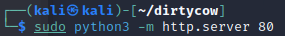

# 1. Port scan
ip=10.10.10.6

sudo nmap -sC -sV $ip

スキャンしたHPにアクセス

http://$ip

gobusterでディレクトリを検索

gobuster dir --url http://$ip/ --wordlist /usr/share/wordlists/dirb/big.txt

/testディレクトリにアクセス

`http://$ip/test`

/torrentディレクトリにアクセス

`http://$ip/torrent/`

`http://10.10.10.6/rename/`

アップロード機能を確認

新規アカウントを作成

ログイン成功

reverse-shellをアップロード

アップロード失敗

torrentファイルをアップロード

アップロード成功

burpsuiteでパケットを受信

repeater昨日でcontent-typeを変更して送信

`sudo nc -lvnp 1234`

「image file Not Found」をクリック

cd /home

cd george

exploit databaseから

Linux Kernel 3.6.37 攻撃用コードを取得

ローカルサーバを立てる

ローカルサーバから15705.cをダウンロード

root権限を取得

root.txtを取得

