# 1.Port Scan
ip=10.129.160.207
nmap -sC -sV $ip

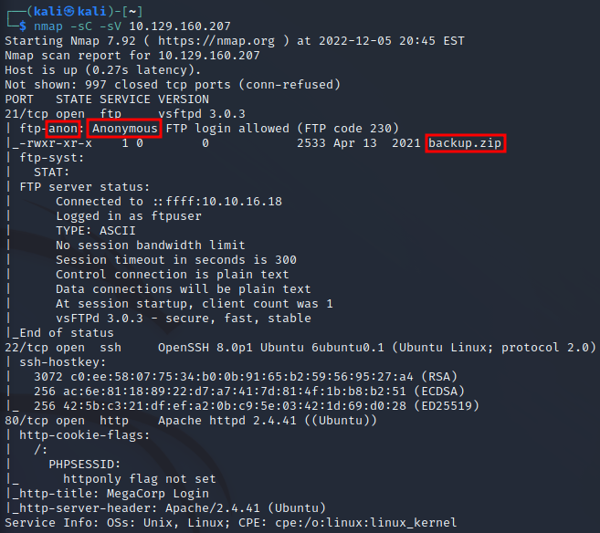

# 2.FTP Login
nmapから得た情報を使いFTPサーバにログインする。
backup.zipを確認。

ftp $ip

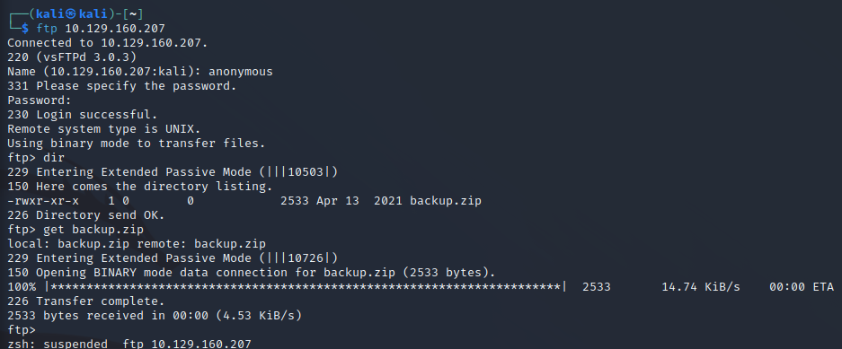

# 3. Zip2john

backup.zupのhase値を出力

`zip2john backup.zip > hashes`

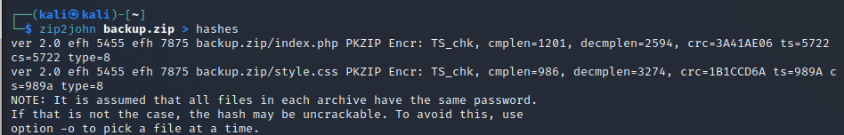

John the Ripperを使いパスワードを解析

`cat hashes`

`john --wordlist=/usr/share/wordlists/rockyou.txt hashes`

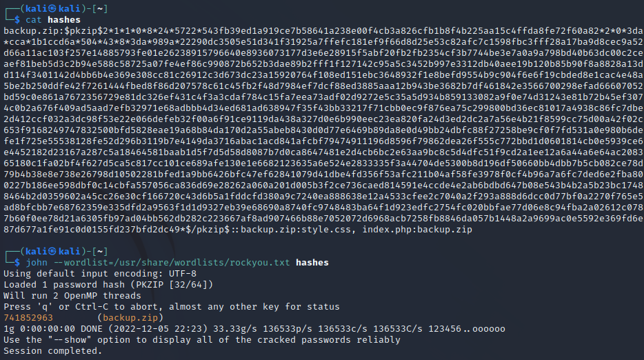

中身を確認
ユーザネームとパスワードを発見

cat index.php

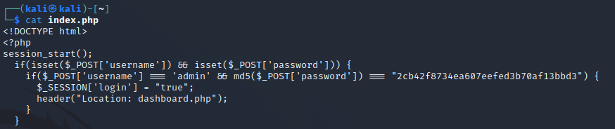

使用できるハッシュ形式を確認。

`hashid 2cb42f8734ea607eefed3b70af13bbd3`  

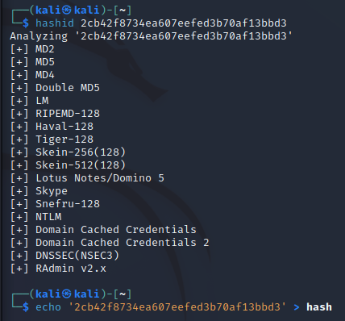

Web site上のadminユーザのパスワードを確認

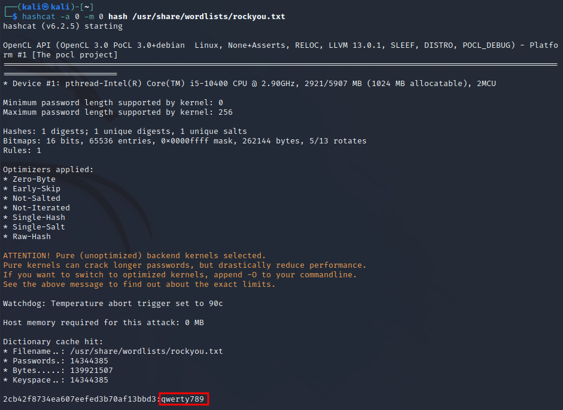

# 4.Web site login

Web siteにログイン

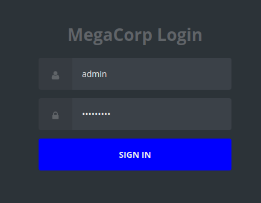

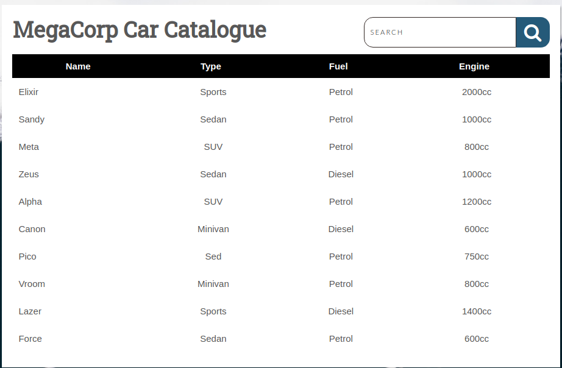

smaple kensaku wo zissi

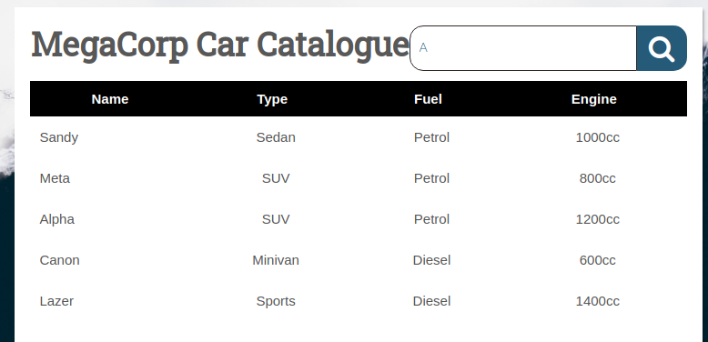

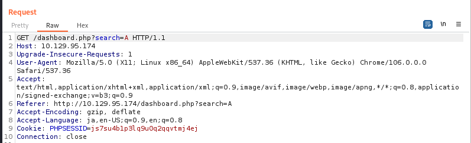rm